## Création d'une VM *Debian* dans *VMWare Workstation*
Dans ce qui suit nous allons voir les étapes de création d'une VM linux *Debian*.

### 1. Créer une VM "vide"
Lancez *Workstation* et allez dans `File -­> New Virtual Machine`:

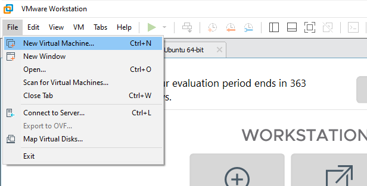

Vous lancerez l'assistant qui vous guidera à travers les différentes étapes pour définir les paramètres de votre VM:

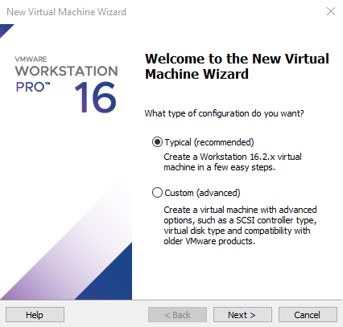

Faites `Next`, puis au dialogue suivant choisissez `I will install the operating system later`:

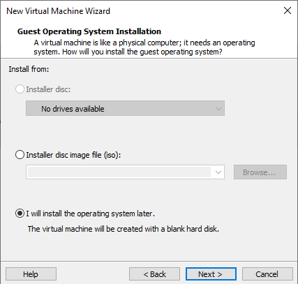

À l'étape suivante, vous spécifiez quel SE vous voulez installer. Ceci permet simplement à Workstation de définir des paramètres généraux mieux adaptés au SE que vous choisissez; il n'est pas obligatoire d'avoir exactement la bonne version ni même le bon SE, mais c'est préférable. Choisissez `Linux` et `Debian 10.x 64-bit`: 

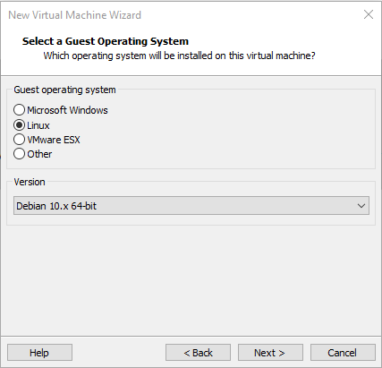

À la fenêtre suivante, donner un nom à la VM que vous êtes en train de créer:

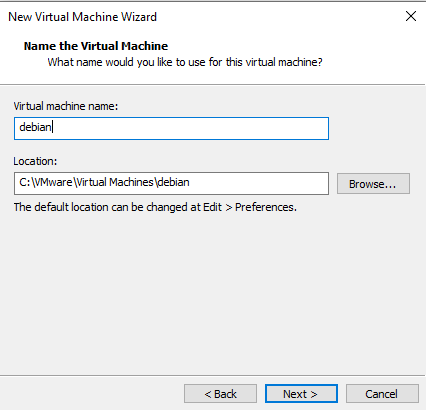

L'étape suivante consiste à définir une taille pour le disque. La taille suggérée pour *Debian 10* est de 20Go; on conserve donc cette valeur:

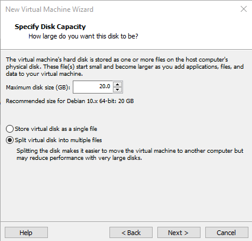

La dernière fenêtre affiche l'ensemble des paramètres de la VM. Le bouton `Customize Hardware` permet de les modifier si on le souhaite; ici, on les laissera tels quels et on cliquera sur `Finish`: 

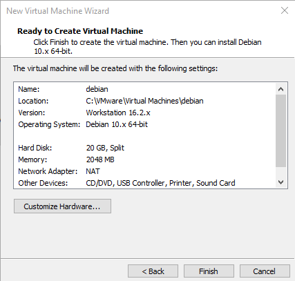

### 2. Se procurer le fichier ISO
Pour installer un système d'exploitation, on doit habituellement obtenir une clé USB ou un DVD d'installation qui contient les fichiers requis pour installer le SE. Le terme ISO désigne un format de fichier qui correspond à l'image d'un DVD et de tout ce qu'il contient. La grande majorité des SE peuvent être installés à partir de fichiers ISO; ici, nous allons télécharger celui de la dernière version de Debian, disponible à l'URL suivant: https://cdimage.debian.org/debian-cd/current/amd64/iso-cd/debian-11.5.0-amd64-netinst.iso.

Puisque le fichier ISO du SE correspond à l'image de DVD d'installation, on doit l'utiliser dans le lecteur DVD virtuel de la VM qu'on vient de créer. Dans l'onglet de votre VM *Debian*, cliquez sur la ligne `CD/DVD (IDE)`. Ceci ouvrira un dialogue où vous pourrez sélectionner le fichier ISO:

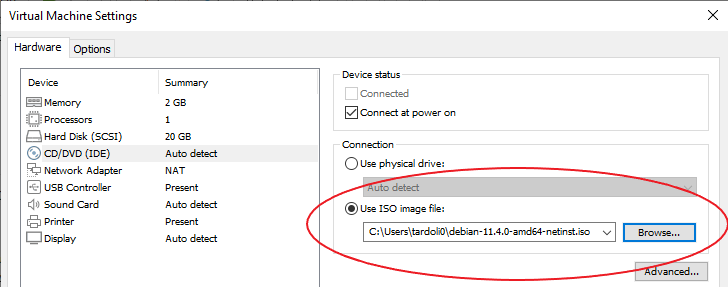

Ensuite, lorsque vous démarrerez la VM, la procédure d'installation débutera.

### 3. Installer le SE
Plusieurs options d'installation sont disponibles; choisissez la première pour une installation en mode graphique:

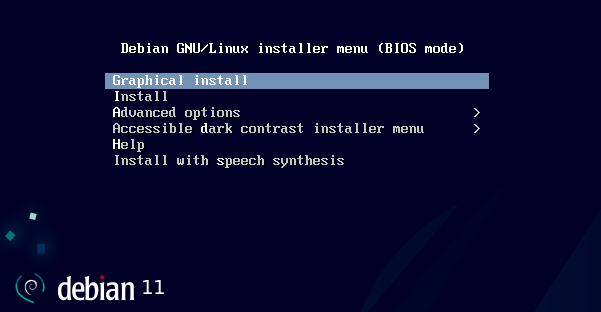

Dans les trois dialogues qui suivent, vous devez sélectionner la langue du système et la disposition du clavier. Choisissez `Français`, `Canada` et `Canadien Français`:

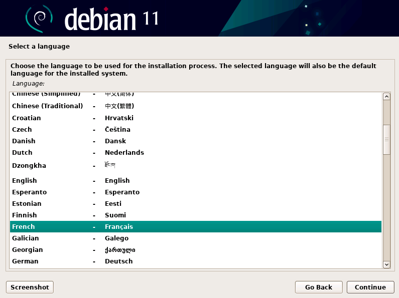

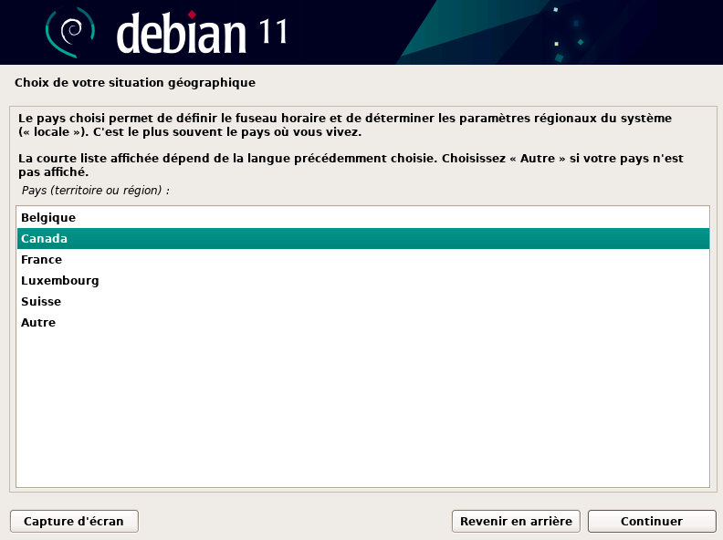

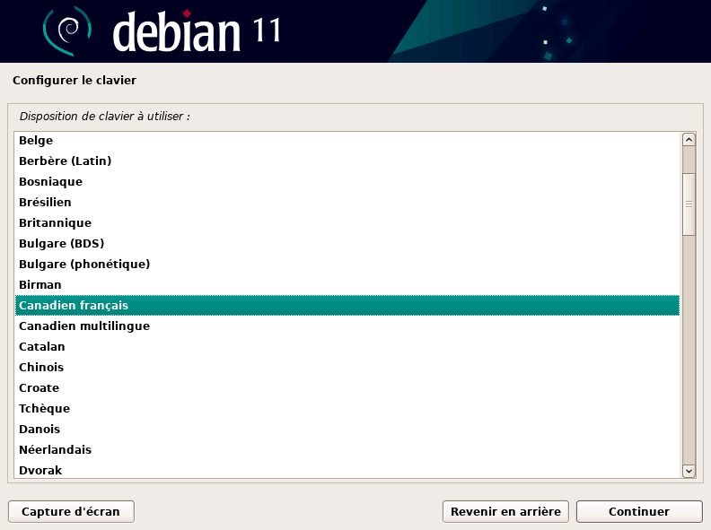

L'installeur prendra ensuite quelques instants pour charger les composantes à installer et détecter le réseau: cette détection est essentielle car plusieurs composantes devront plus tard être téléchargées pour compléter l'installation (ceci permet d'avoir un fichier ISO d'installation moins volumineux).

Ensuite, vous devez donner un nom au système. Vous pouvez choisir ce que vous voulez, tant que ce nom est composé uniquement de lettres et de nombres. Il sert uniquement à identifier le système sur le réseau, et il peut être changé par la suite.

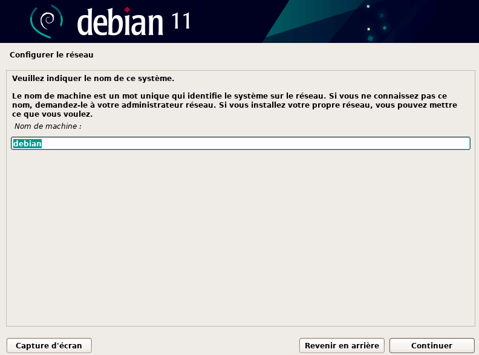

Dans la fenêtre qui suit, il s'agit de spécifier si l'hôte fait partie d'un domaine. Pour nous, ce n'est pas le cas; laissez le champ texte vide et faites `Continuer`:

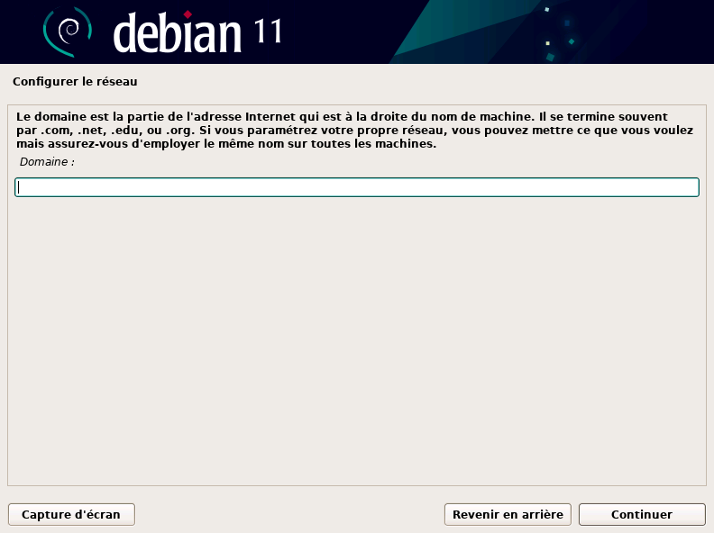

Dans les dialogues qui suivent, vous devez spécifier les identifiants et mots de passe de votre utilisateur et de *root*.

#### ***root***
Sur tout système linux, l'utilisateur ayant tous les privilèges se nomme *root*. On le nomme aussi parfois "administrateur" ou "superutilisateur". Les actions qui requièrent des privilèges élevés (comme installer des programmes, changer des paramètres système, etc.) doivent être accomplies par *root*, et afin d'éviter que n'importe qui utilise ce compte, on lui donne un mot de passe.

Spécifiez le mot de passe pour *root*:

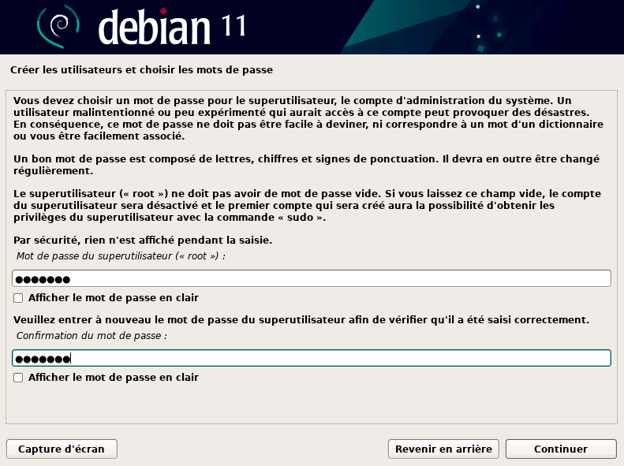

#### **Utilisateur**
Il est fortement déconseillé que *root* soit le seul utilisateur d'un système: on recommande qu'il existe au moins un utilisateur non-privilégié pour les utilisations normales du système (ce qui évite de commettre des erreur irréparables). 

Dans les trois dialogues suivants, vous devez donc donner un nom au nouvel utilisateur pui spécifier son identifiant et son mot de passe:

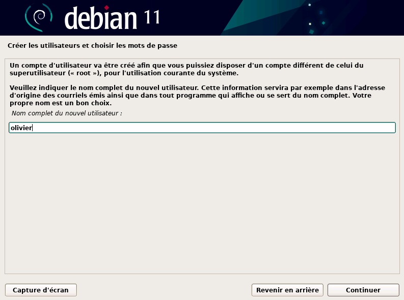

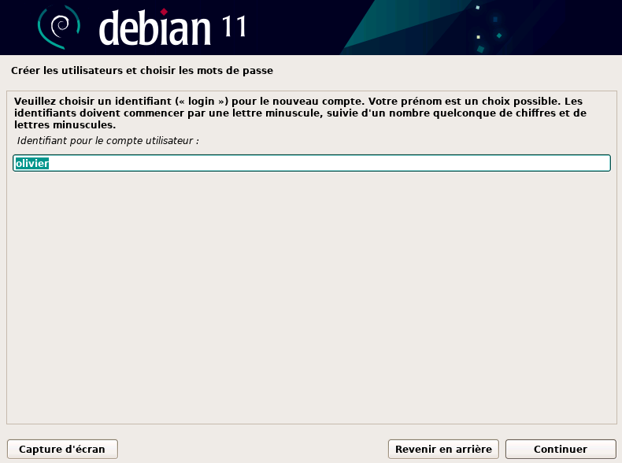

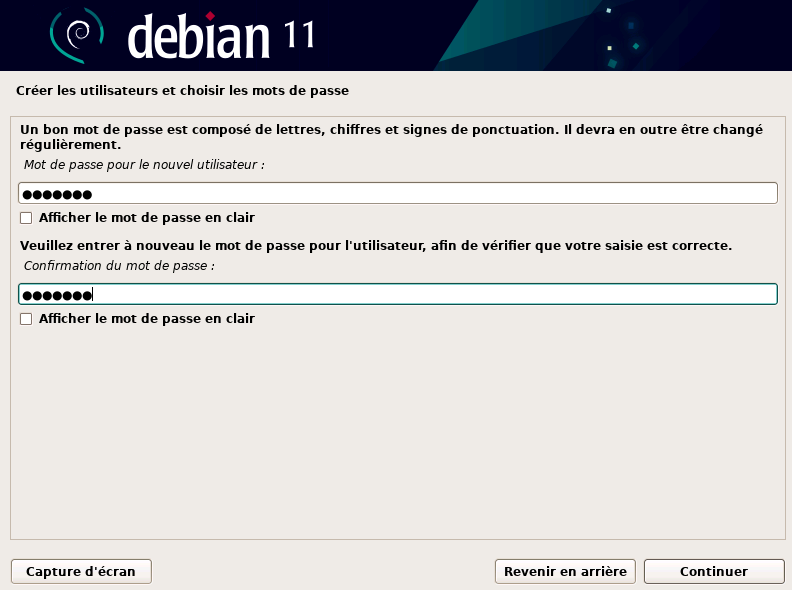

Dans la fenêtre suivante il s'agit de déterminer le fuseau horaire où vous vous trouvez. *Debian* synchronisera ensuite l'horloge interne en se connectant à des serveurs de temps sur internet, puis appliquera le décalage qui correspond au fuseau horaire spécifié ici:

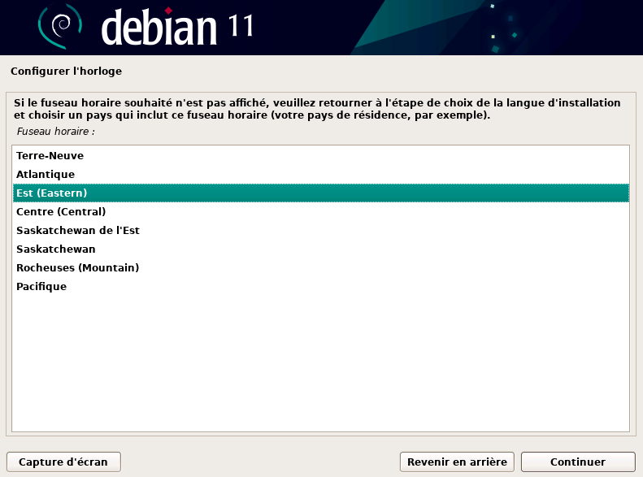

#### **Partitionnement des disques**
Au moment de l'installation d'un SE, il est possible de subdiviser le disque en plusieurs __partitions__, ce qui peut avoir plusieurs avantages: faciliter les sauvegardes ("backups"), organiser efficacement les stockage, créer de la redondance à des fins de sécurité, installer un deuxième SE en multi-amorçage, etc. Ici, puisque nous allons simplement installer *Debian* sur tout le disque, choisissez `Assisté - utiliser un disque entier`:

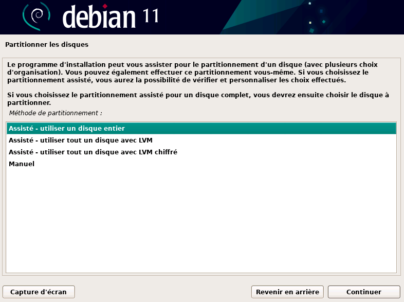

À cette étape, vous devez choisir le disque matériel à partitionner. Dans notre cas il n'y en a qu'un seul (nommé "sda"), donc c'est celui qu'on doit sélectionner:

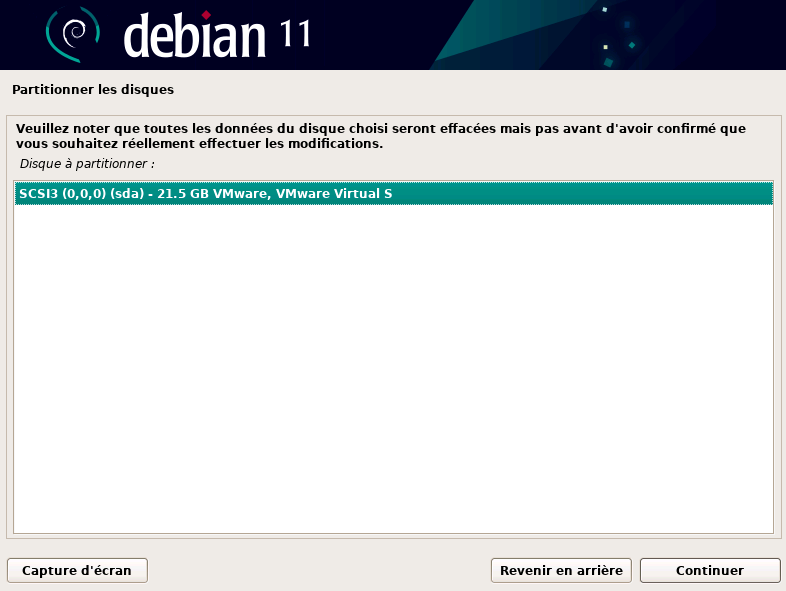

L'assistant propose trois modèles de partitionnement. On choisit le premier:

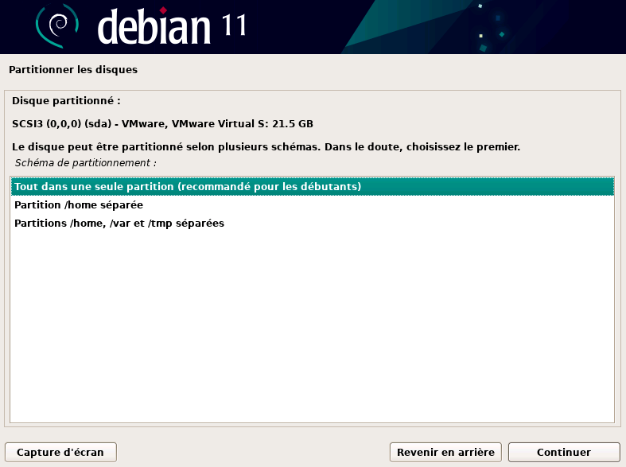

Dans le dialogue qui suit on affiche les informations de partitionnement du disque conformément aux choix faits précédemment. Si on ne souhaite pas y apporter des modifications, on sélectionne `Terminer` et on continue. Comme le partitionnement a pour effet d'effacer les disques, on nous demande de confirmer notre choix:

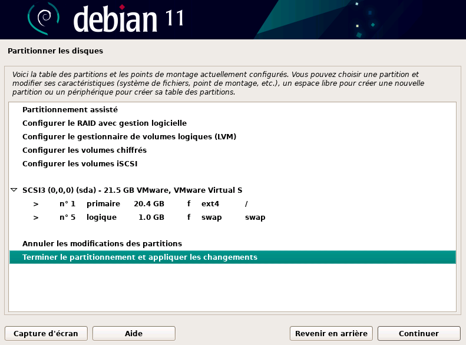

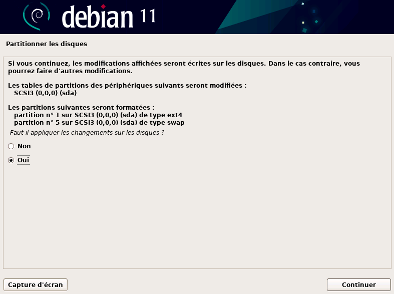

L'installeur partitionnera ensuite le disque et y copiera les fichiers de base du système. Cela peut prendre quelques instants.

Les fichiers installés jusqu'ici ne constituent que le minimum. Le SE *Debian* a besoin de plusieurs autres logiciels pour être complet: c'est sur internet qu'il ira les chercher, mais juste avant on nous demande si on dispose d'un medium d'installation (clé usb ou DVD) qui contient ces logiciels. Puisque ce n'est pas le cas, on répond "non" et on continue:

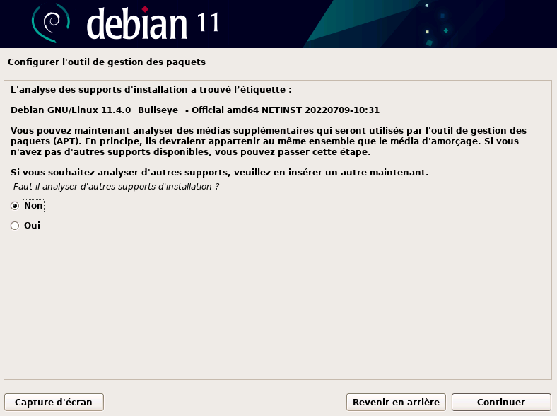

*Debian*, comme tous les systèmes d'exploitation, n'est pas constitué d'un logiciel unique: c'est en réalité une foule de programmes qui travaillent ensemble. Comme le ISO d'installation est minimal, la majorité de ces programmes doit être téléchargée à partir de serveurs.

*Debian* dispose de nombreux serveurs à travers le monde qui rendent disponibles ces programmes. Les deux prochaines étapes consistent donc à en trouver un assez proche géographiquement pour que le téléchargement soit rapide:

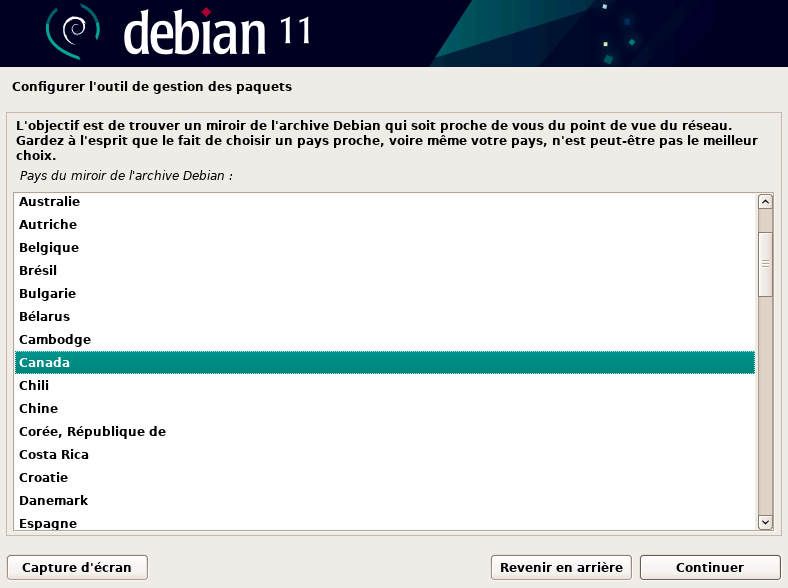

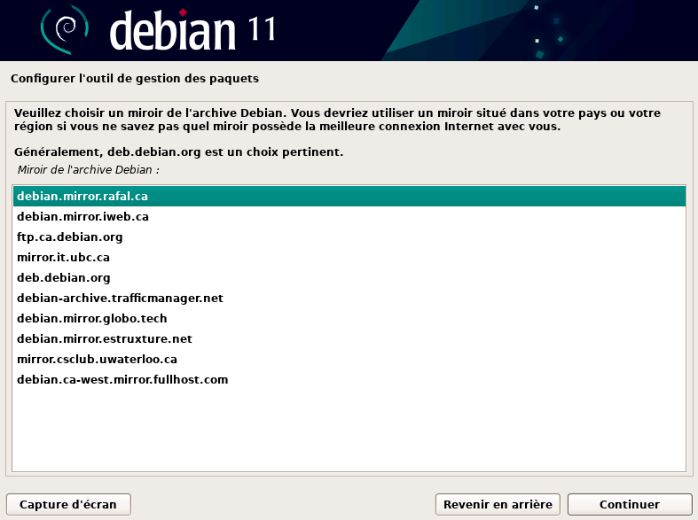

Parfois l'ordinateur sur lequel on veut installer un SE est derrière un "proxy". Un proxy est une mesure de sécurité qui consiste à limiter les accès internet entrants ou sortants. Dans notre cas, il n'y a pas de proxy entre nous et internet, on laisse donc ce champ vide et on continue:

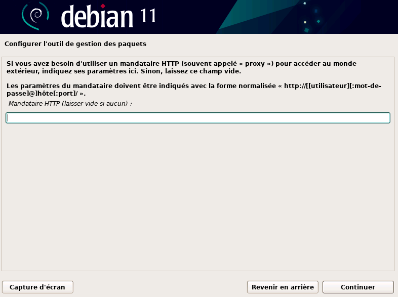

L'installeur prendra ensuite quelques instants pour mettre à jour les informations sur les logiciels disponibles. Ensuite, on nous demande si on souhaite que des statistiques touchant à notre utilisation de logiciels soient envoyées aux développeurs de *Debian*; vous pouvez cocher "non" et poursuivre: 

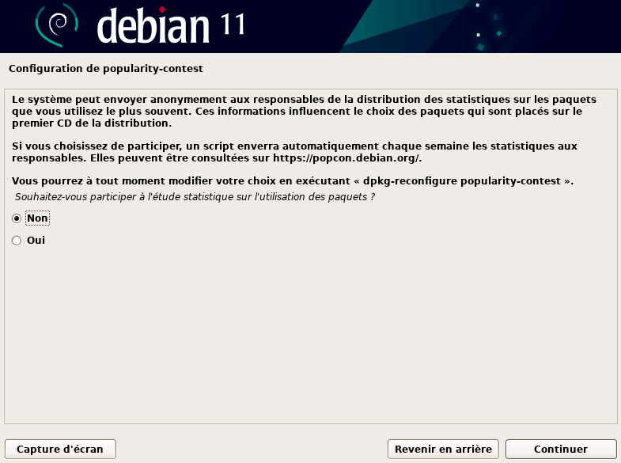+

Enfin, on peut choisir quelques options d'installation. 

#### **Environnenent de bureau**
Les systèmes d'exploitation *MacOS* et *Windows* sont facilement identifiables par leurs caractéristiques graphiques: icônes, boutons des fenêtres, barres de tâches, fonds d'écran... ces aspects, très importants pour les utilisateurs, ne sont toutefois que la surface visible du système d'exploitation. Il constituent ce qu'on nomme *l'environnement de bureau* et servent à faciliter l'accès aux fonctionnalités du SE par les utilisateurs. 

Dans l'univers linux, il existe de très nombreux environnements de bureaux différents; certains sont très recherchés au niveau visuel, d'autres moins; certains sont très efficaces, mais un peu plus difficiles à apprendre; etc. Dans le dialogue suivant, on peut choisir l'environnement de bureau parmi une liste. Choisissez `Gnome` (vous pourrez en ajouter d'autres après l'installation si cela vous intéresse de les découvrir). Aussi, laissez cochée l'option `utilitaires usuels du système`:

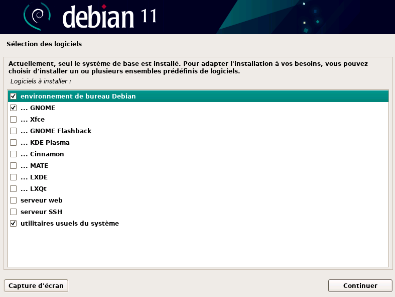

Ici, vous devrez attendre quelques minutes: *Debian* télécharge tous les programmes requis par le système et les installe ensuite.

Ensuite on vous conseille d'installer GRUB sur le disque. 

GRUB est un programme qui s'exécute avant même que le système d'exploitation ne soit chargé. Ceci permet de choisir quel SE on veut lancer, mais aussi donne accès à une ligne de commande qui peut dans certains cas être utile pour dépanner un système qui ne démarre pas normalement. Faites `oui` et continuez, puis spécifiez `/dev/sda` comme disque d'installation pour GRUB: 

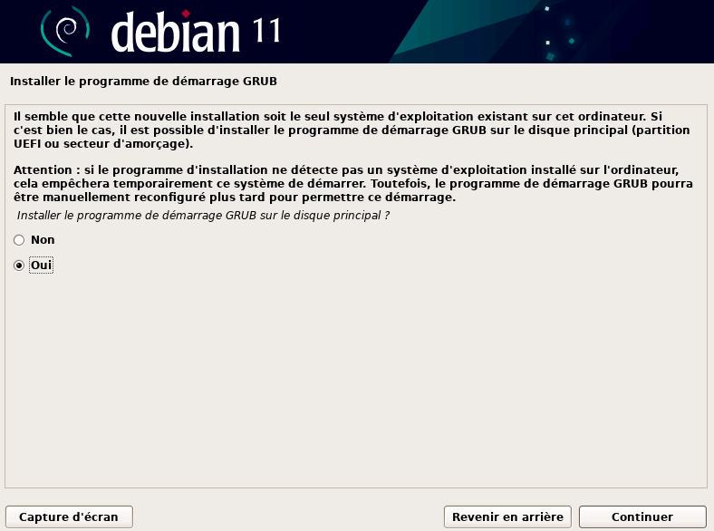

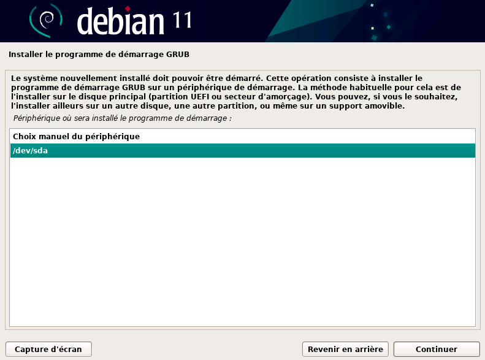

Voilà, c'est terminé! Vous pouvez ensuite redémarrer votre VM pour utiliser *Debian*.

