# Procédure de multi-amorçage Windows 10 et Linux Debian
### Prérequis
+ Avoir installé Windows 10
+ Avoir un firmware de type UEFI sur la VM Windows
  
#### 1. Démarrez la VM *Windows*, ouvrez une session, puis lancez le programme de partitionnement des disques.
<kbd>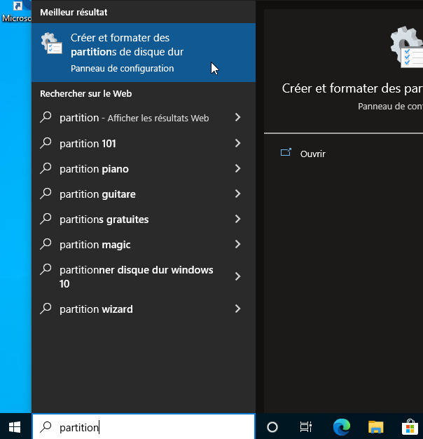</kbd>

#### 2. Redimensionnez la partition *Windows* du disque `C:` afin de l'amener à la taille désiré. Éteignez ensuite la VM *Windows*.
<kbd>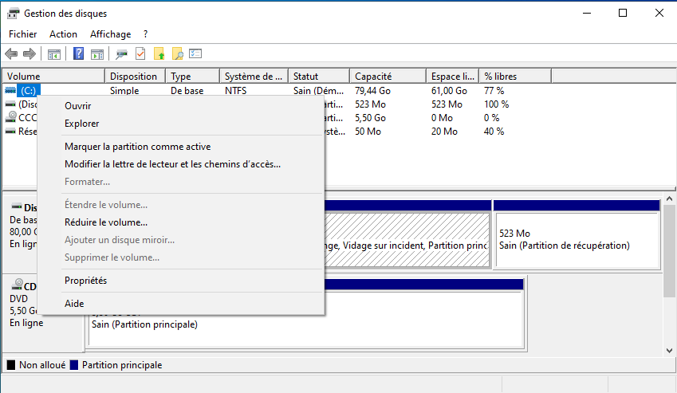</kbd>

#### Ici la taille finale sera de 56343 Mo ou 56.343 Go (Ceci est un exemple)
<kbd>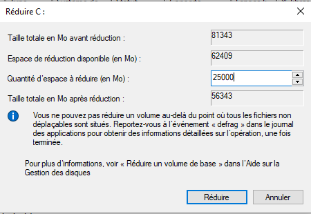</kbd>

#### 3. Dans les paramètres de la VM *Windows*, insérez le fichier ISO d'installation de *Debian* dans le lecteur CD/DVD.
<kbd>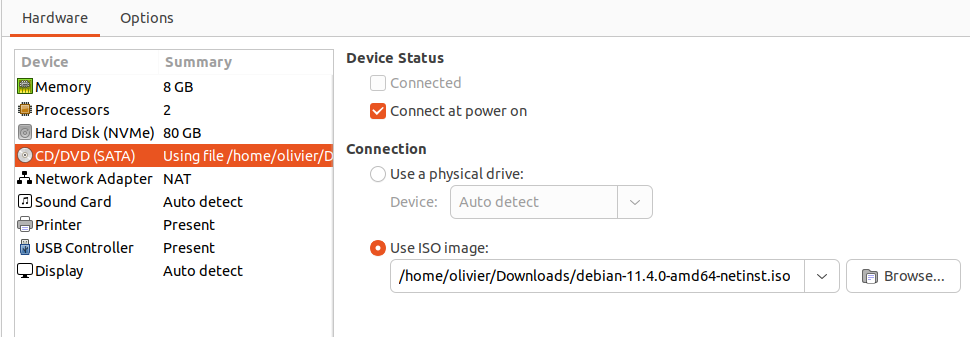</kbd>

#### 4. Démarrez la VM *Windows* à l'aide du menu `VM -> Power -> Power On to Firmware`
<kbd>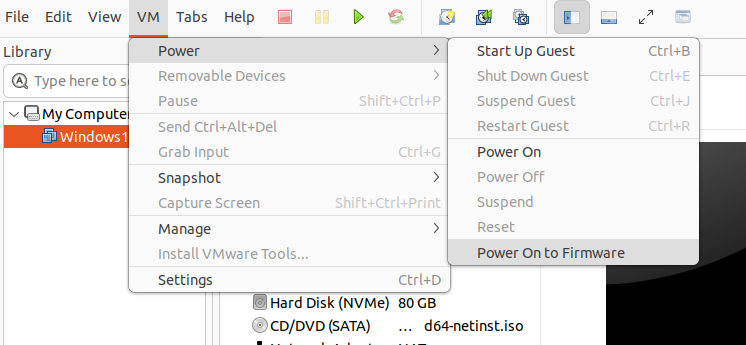</kbd>

#### 5. Dans le "BootManager", choisissez de 'boot' avec ce qui se trouve dans le CDROM Drive. 
<kbd>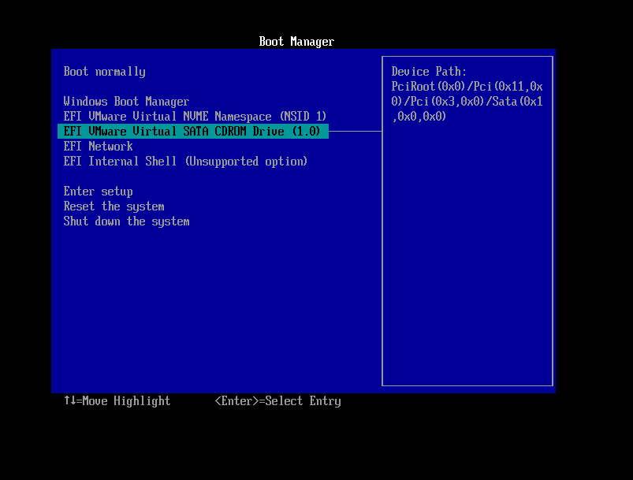</kbd>

#### 6. Installez *Debian* normalement jusqu'à l'étape du partitionnement.(Utiliser l'installation graphique)
#### 7. Au moment de partitionner les disques, vous devrez choisir d'installer *Debian* dans l'espace que vous avez libéré à l'étape 2. Choisissez "Manuel". 
<kbd>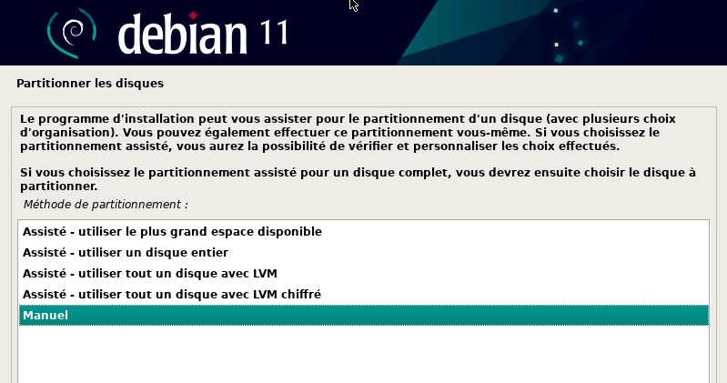</kbd>

#### 8. Sélectionnez l'espace libre de 20Go ou plus, puis laissez *Debian* partitionner automatiquement cet espace
<kbd>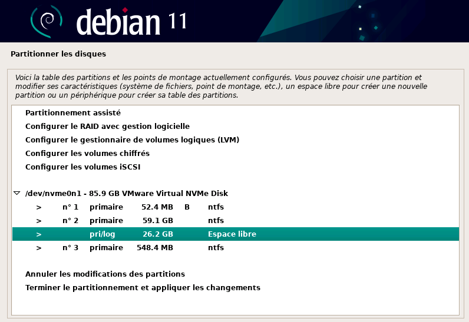</kbd>

#### Choisisser créer une nouvelle partition. Si nous voulions que debian prenne tout l'espace libre nous pourions faire Partitionner automatiquement l'espace libre, mais nous voulons lui accorder un espace fixe.
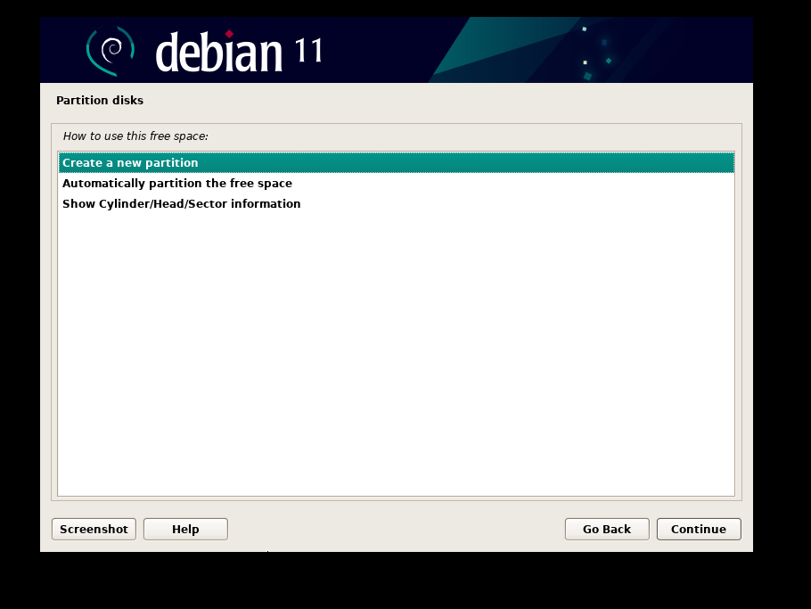

#### Entrez la taille désiré
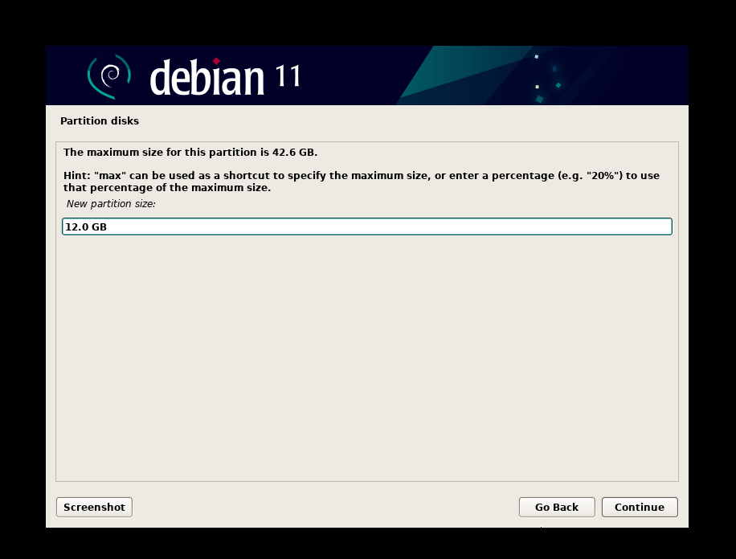

#### Nommez la partition pour pouvoir la retrouver facilement parmis les autres. (Pas de caractère bizarre, juste des lettres en minuscule et sans accent)
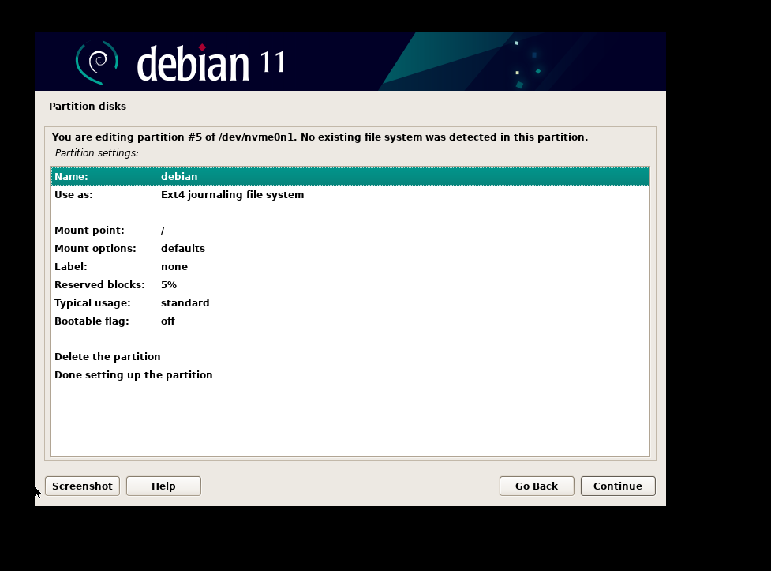

#### Vérifié sa création puis continuer
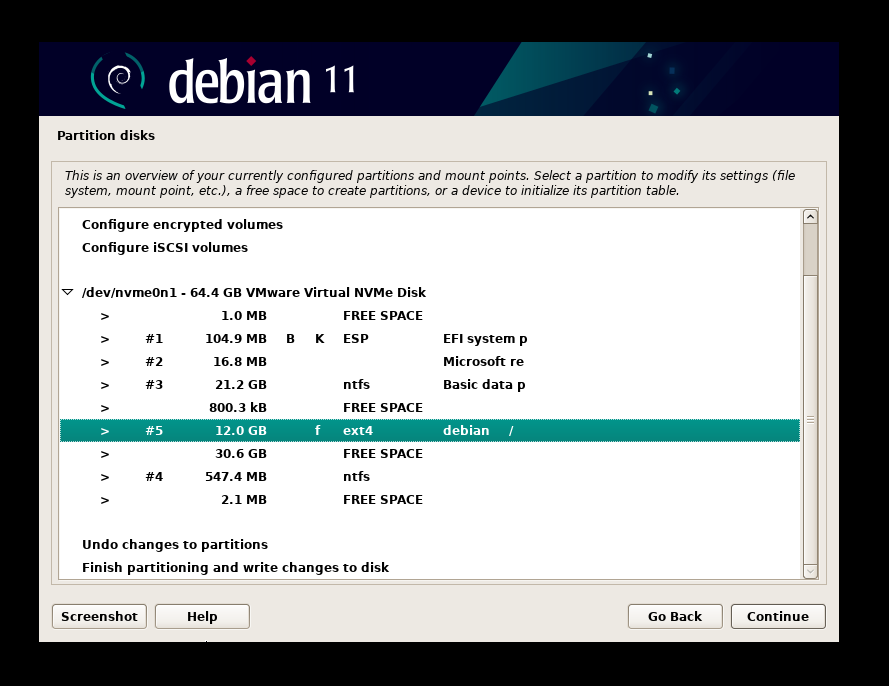

#### 9. Ensuite, choisissez "Tout dans une seule partition" et poursuivez comme pour une installation normale.
<kbd>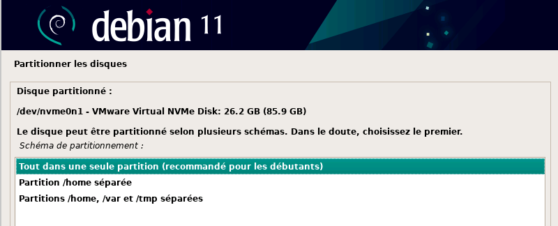</kbd>

Lors du redémarrage, GRUB devrait vous permettre de choisir entre *Windows 10* ou *Debian* comme système d'exploitation.
