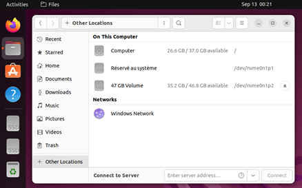

1.	Sur le bureau de votre VM Windows, créez un fichier et écrivez-y ce que vous voulez. Éteignez ensuite la VM.

EDIT: Faites un snapshot ici, car les manipulations suivantes risques de corrompre le système de fichiers de windows.

2.	Téléchargez le fichier ISO de Ubuntu 22.04 Desktop sur votre poste de travail.
3.	Insérez le fichier ISO de Ubuntu dans le lecteur CD/DVD de votre VM Windows
4.	Assurez-vous que le lecteur CD/DVD précède le disque dans l’ordre d’amorçage de la VM Windows, puis démarrez-la.
5.	Au démarrage de Ubuntu, choisissez “Try Ubuntu”: ceci vous permet de l’utiliser sans l’installer, car l’exécution du système d’exploitation linux se fait exclusivement à partir du CD/DVD.
6.	Dans la barre des programmes à gauche, ouvrez l’application “Files” puis sélectionnez “Other Locations” :

7.	Trouvez ensuite parmi les disques disponibles celui qui correspond à votre disque Windows. Pouvez-vous retrouver et lire le document que vous avez créé à l’étape 1 ?
