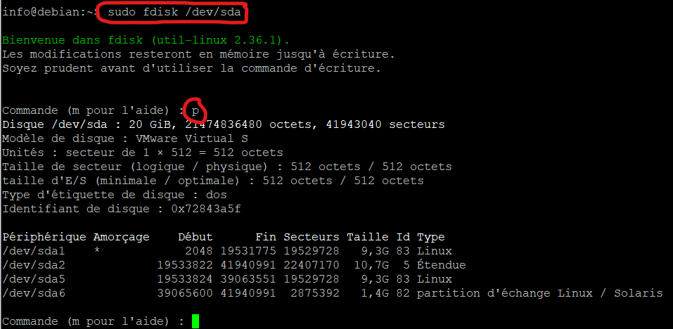

# Système de fichiers
Dans les systèmes unix et linux, la structure des répertoires et des fichiers est toujours la même: la racine est désignée par `/` et les répertoires sont organisés en hiérarchie, comme un arbre inversé.

Sur le disque cependant, les données sont organisées en ***blocs***. Un bloc est une séquence d'octets d'une certaine taille (par exemple 4K pour le système *ext4*). Ainsi un fichier de grande taille sera stocké dans plusieurs blocs sur le disque. Ceci permet de gérer l'espace de manière plus efficace, mais a pour effet que des fichiers peuvent se retrouver à plus d'un endroit sur le disque.

Le ***système de fichiers*** est la partie du système d'exploitation qui se charge de faire correspondre les fichiers et les répertoires dans la hiérarchie aux blocs de données écrits sur le disque. Il en existe plusieurs types: certains sont conçus pour être performants, d'autres pour optimiser l'utilisation de l'espace disque, d'autres pour minimiser les erreurs, etc. Le tableau suivant en énumère quelques uns:

| Nom | SE compatible | Particularité |
| --- | ------------- | ------------- |
| btrfs | Linux | Comprend plusieurs fonctionnalités utiles (*snapshots*, compression, etc.) |
| ext4 | Linux | Le système par défaut de la majorité des distributions linux |
| FAT32 | Windows, Linux | Simple mais limité : les fichiers ne peuvent pas dépasser 4GB en taille |
| NTFS | Windows, Linux | Le système par défaut des SE Windows |
| XFS | Linux | Similaire à ext4 mais plus performant |
| ZFS | Linux | Conçu pour des grandes quantités de données sur plusieurs disques |


## Supports de stockage: disques internes et USB
Généralement on nomme *disque* le périphérique où on lit et écrit les fichiers dans un système d'exploitation; la raison est que depuis longtemps les périphériques servant au stockage ont la forme d'un disque. Mais ce n'est pas toujours le cas: au tout début de l'informatique les informations étaient écrites sur des cartes perforées puis ensuite on a utilisé des rubans magnétiques; aujourd'hui on utilise de plus en plus des périphériques de stockage à circuits intégrés ("solid-state" ou SSD, comme des clés USB) mais les disques durs (HDD) sont encore très répandus. 

Dans linux chaque disque est représenté comme un fichier dans le répertoire `/dev`. Le nom du disque correspond à une lettre: s'il n'y a qu'un disque dans le système il sera nommé `/dev/sda`; s'il y a d'autres disques (incluant les disques amovibles ou les clés USB) ils seront nommés `/dev/sdb`, `/dev/sdc`, etc.


## Partitions
Un périphérique de stockage (SSD ou HDD) peut être divisé en une ou plusieurs ***partitions***, ainsi chaque partition peut être traitée comme un périphérique distinct, ou encore utiliser des systèmes de fichiers différents. Ceci est utile dans différents contextes:
+ Créer des environnements "multi-boot", où on peut choisir entre différents systèmes d'exploitation au moment du démarrage;
+ Séparer le système d'exploitation des programmes et des données afin de le changer ou de la réinstaller plus facilement;
+ Stocker des données de type différent sur des partitions ayant différents systèmes de fichiers optimisés pour différents usages.

### Noms des partitions
Les partitions d'un disque sont elles aussi énumérées comme des fichiers de type spécial 'b' (pour "block device") dans le répertoire `/dev`. Les numéros 1 à 4 sonr réservées aux partitions primaire et étendue; les partitions logiques débutent à 5.

```
info@debian:~$ ls -l /dev/sd*
brw-rw---- 1 root disk 8,  0 13 nov 21:18 /dev/sda
brw-rw---- 1 root disk 8,  1 13 nov 21:18 /dev/sda1
brw-rw---- 1 root disk 8,  2 13 nov 21:18 /dev/sda2
brw-rw---- 1 root disk 8,  5 13 nov 21:18 /dev/sda5
brw-rw---- 1 root disk 8,  6 13 nov 21:18 /dev/sda6
brw-rw---- 1 root disk 8, 16 13 nov 21:36 /dev/sdb
brw-rw---- 1 root disk 8, 17 13 nov 21:36 /dev/sdb1
```
Dans l'exemple qui précède, on peut ainsi déduire que :
+ Le système a deux disques (**sda** et **sdb**)
+ Le premier disque a une partition primaire (**sda1**) et une partition étendue (**sda2**)
+ Le premier disque a deux partitions logiques (**sda5** et **sda6**)
+ Le deuxième disque n'a qu'une partition primaire (**sdb1**)

### Types de partitions
Il existe 3 types de partition:
+ Primaire
+ Étendue
+ Logique

#### Partition primaire
Habituellement, on installe le système d'exploitation sur une partition primaire, et un disque peut avoir au maximum 4 partitions primaires. 

#### Partition étendue
La partition étendue n'est pas créée comme telle: elle correspond seulement à l'espace qui reste sur le disque lorsqu'on a créé les partitions primaires. Cet espace est utilisable uniquement si on a 3 partitions primaires ou moins.

#### Partition logique
Les partitions logiques sont créées à l'intérieur de la partition étendue. On peut en créer autant qu'on veut, et il est possible en linux (mais pas dans Windows) d'avoir un système d'exploitation amorçable dans une partition logique.

### Fichier *swap*
Le fichier d'échange ("swapfile") est un fichier qui est utilisé, à la base, par le SE pour stocker le contenu de la RAM lorsque les données mises en mémoire dépassent la capacité de la mémoire du système. Le SE y écrit aussi les données à garder en mémoire mais qu'il juge peu susceptibles d'être modifiées; aussi, certains SE y écrivent les données qui se trouvent dans la RAM au moment où le système se met en mode d'hibernation. Donc, le fichier *swap* n'est pas essentiel, mais peu importe la quantité de RAM de votre système il sera utile et permettra d'optimiser l'utilisation de la RAM.

Il y a plusieurs opinions sur la taille idéale du fichier *swap*; mais au minimum sa taille doit être 1/5 de la quantité de mémoire du système.  

### `fdisk`
La commande `fdisk` permet de créer, supprimer ou modifier des partitions dans linux. C'est une commande qui est principalement utilisée de manière *interactive*: lorsqu'on la lance, on doit choisir des options et répondre à des questions pour effectuer les tâches et arriver au résultat souhaité:



Dans l'exemple précédent on utilise `fdisk` sur le disque `/dev/sda`, puis la sous-commande ***p*** pour voir la table de partition de ce disque. 

La sous-commande ***m*** affiche la liste des sous-commandes possibles. Celles qui permettent de modifier la table de partitions sont les suivantes:

| Commande | Utilité |
| -------- | ------- |
| `p` | Afficher la table de partitions |
| `d` | Supprimer une partition |
| `n` | Ajouter une partition |
| `w` | Appliquer les changements et quitter |
| `q` | Quitter sans appliquer les changements |

> ATTENTION : Avant de supprimer une partition, il faut *démonter* le système de fichiers qui lui est associé avec la commande [`umount`](#umount).

En mode non-interactif, on utilise généralement cette commande avec l'option `-l` pour voir la liste des partitions de tous les disques connectés:

```
info@debian:~$ sudo fdisk -l

Disque /dev/sda : 20 GiB, 21474836480 octets, 41943040 secteurs
Modèle de disque : VMware Virtual S
Unités : secteur de 1 × 512 = 512 octets
Taille de secteur (logique / physique) : 512 octets / 512 octets
taille d'E/S (minimale / optimale) : 512 octets / 512 octets
Type d'étiquette de disque : dos
Identifiant de disque : 0x72843a5f

Périphérique Amorçage    Début      Fin Secteurs Taille Id Type
/dev/sda1    *            2048 19531775 19529728   9,3G 83 Linux
/dev/sda2             19533822 41940991 22407170  10,7G  5 Étendue
/dev/sda5             19533824 39063551 19529728   9,3G 83 Linux
/dev/sda6             39065600 41940991  2875392   1,4G 82 partition d'échange Linux / Solaris


Disque /dev/sdb : 465,73 GiB, 500074283008 octets, 976707584 secteurs
Modèle de disque : My Passport 0740
Unités : secteur de 1 × 512 = 512 octets
Taille de secteur (logique / physique) : 512 octets / 512 octets
taille d'E/S (minimale / optimale) : 512 octets / 512 octets
Type d'étiquette de disque : dos
Identifiant de disque : 0x00030c0a

Périphérique Amorçage Début       Fin  Secteurs Taille Id Type
/dev/sdb1                63 976703804 976703742 465,7G  7 HPFS/NTFS/exFAT
```

Dans cet exemple, on voit des informations supplémentaires sur les disques vus [plus haut](#noms-des-partitions), plus spécifiquement: l'endroit où chaque partition commence et finit sur le disque physique, son type ("linux" désigne *ext2*, *ext3* ou *ext4*) et sa taille.


### `mount`
Cette commande permet de monter le système de fichier d'une partition.

La commande `mount`, sans option, affiche les différents points de montage des périphériques. Dans l'exemple suivant on la redirige vers `grep` afin de voir seulement les informations sur les disques (`/dev/sd`):
```
info@debian:~$ mount |grep "/dev/sd"
/dev/sda1 on / type ext4 (rw,relatime,errors=remount-ro)
```
Dans cet exemple on voit que la partition `/dev/sda1` est montée sur `/`, la racine; donc c'est le disque principal du système d'exploitation.

> Un *point de montage* est le répertoire dans la hiérarchie à partir duquel on accède au périphérique de stockage. Par exemple si une clé USB correspond au périphérique `/dev/sdc1` et qu'on lui donne le point de montage `/media/usb`, alors on pourra voir le contenu de la clé USB avec la commande `ls /media/usb`.  

#### Qu'est-ce que le *montage*?
Les partitions d'un disque contiennent différentes sortes de données: le contenu des fichiers, écrits dans les *blocs*, et d'autres données qui sont utiles au système de fichiers. Ces dernières sont différentes selon que le système de fichiers est NTFS, ext4, XFS, etc. 

Le montage d'un système de fichier est l'opération qui consiste à rendre accessible les données sur le disque dans la hiérarchie des fichiers et des répertoires sur linux. On peut spécifier des options lors du montage, par exemple interdire les opérations d'écriture sur le disque, interdire l'exécution de fichiers, etc. Lors du montage, pour que linux puisse bien comprendre l'organisation des fichiers et répertoires sur le disque, il faut lui dire quel système de fichier est utilisé, et quelles options de montage on souhaite activer.

Par exemple, la commande suivante permet de monter un fichier nommé *image.iso* en mode "lecture seule" (ro), sur le point de montage `/media`:
```
info@debian:~$ mount -o ro image.iso /media
```

> REMARQUE: Dans linux, les disques internes sont montés automatiquement. La commande `mount` est donc utile pour les disques externes et certains types de fichiers comme les fichiers ISO.

### `umount`
La commande `umount` sert à démonter un système de fichiers. Elle a comme argument le point de montage du système de fichiers à démonter:
```
info@debian:~$ umount /media
```

### `du`
Permet de voir l'espace occupé par un répertoire et ses sous-répertoires ("disk use"). Son argument est le répertoire visé; si on n'en spécifie pas, `du` partira de la racine. Par exemple, la commande suivante affiche l'espace total (en MB) occupé par le répertoire `/home/info`:
```
info@debian:~$ du -sh  /home/info
245M	/home/info
``` 
Les options les plus courantes sont les suivantes:

| Option | Utilité | Exemple |
| ------ | ------- | ------- |
| `-h` | Affiche l'espace utilisé en K, M ou G | <nobr>`du -h /etc`</nobr> |
| `-s` | Affiche le total seulement | <nobr>`du -s /`</nobr> |
| `-d` | Limite l'affichage à une profondeur ("depth") donnée, spécifié par une valeur numérique | <nobr>`du -d 2 /var`</nobr> |


### `df`
Affiche l'espace libre sur chacun des systèmes de fichiers montés. On l'appelle généralement sans argument comme suit:
```
info@debian:~$ df -h
Sys. de fichiers Taille Utilisé Dispo Uti% Monté sur
udev               952M       0  952M   0% /dev
tmpfs              195M    1,4M  194M   1% /run
/dev/sda1           19G    5,0G   13G  29% /
tmpfs              975M       0  975M   0% /dev/shm
tmpfs              5,0M       0  5,0M   0% /run/lock
tmpfs              195M    108K  195M   1% /run/user/1000
```

Les deux options les plus courantes sont les suivantes:
| Option | Utilité | Exemple |
| ------ | ------- | ------- |
| `-h` | Affiche l'espace utilisé en K, M ou G | <nobr>`df -h`</nobr> |
| `-T` | Affiche le type du système de fichiers parmi les résultats | <nobr>`df -T`</nobr> |


