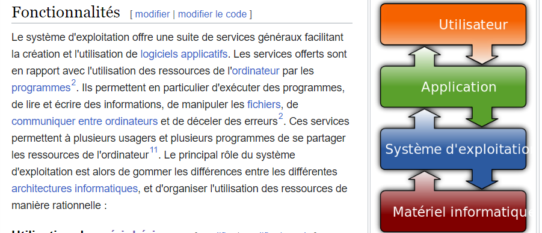
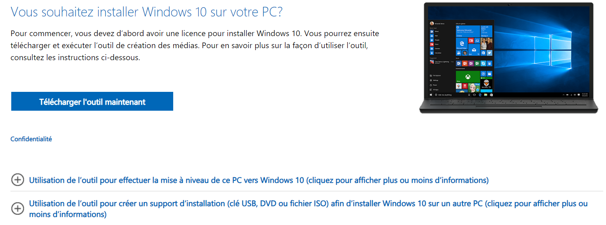
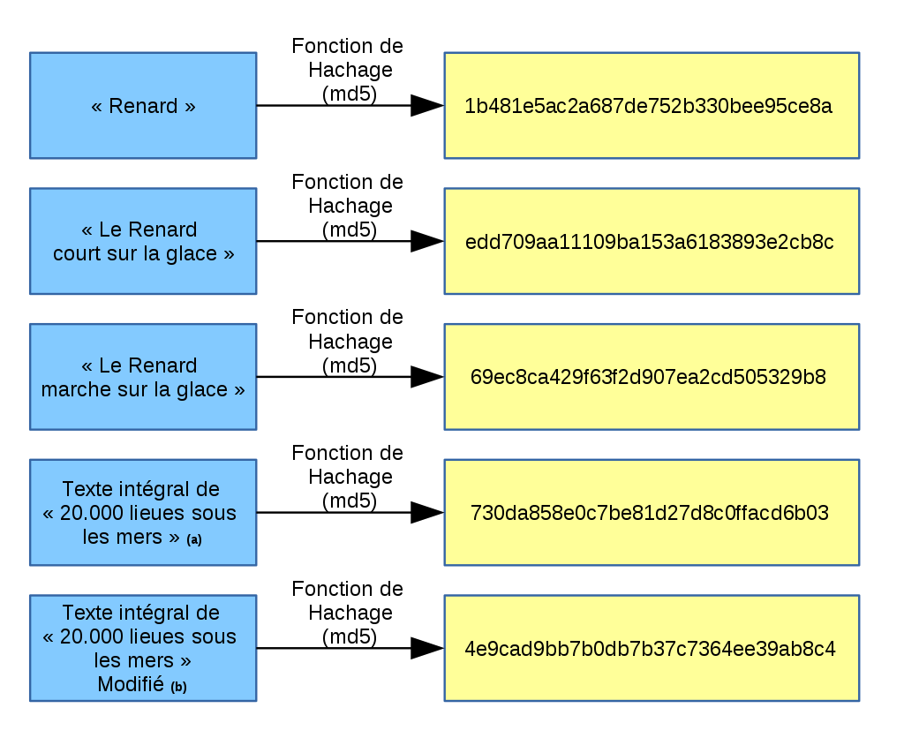

systeme exploitation
Source wikipedia : https://fr.wikipedia.org/wiki/Syst%C3%A8me_d%27exploitation

Différent système d'exploitation connus:

- Windows
- macOS
- Unix
- Linux
- Chrome OS
- Android
- iOS

Il gère :
- Utilisation des périphériques
- Accès aux fichiers
- Accès aux ressources
- Détection et récupération en cas d'erreur
- Contrôle
image iso

## Utilisation des périphériques

L'une des responsabilités du système d'exploitation est de gérer l'état d'utilisation du matériel informatique, en le réservant pour un processus lorsque nécessaire. Pour utiliser un périphérique, le système d'exploitation utilise un contrôleur et un pilote de périphérique.

## Accès aux fichiers

Chaque périphérique doit être lu selon son propre protocole et un mécanisme de protection de l'information permettant de choisir qui à accès à quel information est aussi contrôlé par le SE. C'est le SE qui gère le conflit lorsque plus d'une demande d'accès est faites simultanément.

## Accès au ressources

CPU, mémoire vive, fichier, etc. Toutes les ressources de l'ordinateur doivent posséder le même contrôle que les fichiers. 

## Détection et récupération en cas d'erreur

En cas d'erreur, qu'elle soit d'origine matérielle ou logicielle, le système d'exploitation prend des mesures pour minimiser son impact sur le système informatique. Il peut essayer de répéter l'opération, interrompre l'exécution du programme défectueux ou informer l'utilisateur du problème

## Contrôle

Un système d'exploitation peut tenir des statistiques d'utilisation des ressources, surveiller la performance, et les temps de réponse.

Responsable de 
- Exécution et ordonnacement des programmes

- Communication entre programmes

- Gestion des droits et accès

- Gestion des ressources matériel de l'ordinateur

- Gestion des périphériques

- Manipulation des systèmes de fichiers

- Gestion du réseau

https://www.microsoft.com/fr-ca/software-download/windows10

machine virtuelle

mémoire Virtuelle

La mémoire virtuelle est un mécanisme couramment utilisé dans les systèmes d'exploitation modernes pour simuler la disponibilité de plus de mémoire centrale que ce qui est réellement disponible. Elle permet l'exécution simultanée de plusieurs programmes en stockant une partie de leurs données dans une mémoire de masse plus grande mais plus lente. Les programmes disposent d'espaces virtuels de mémoire, et lorsque leur accès à des données est nécessaire, l'unité de gestion mémoire traduit les adresses virtuelles en adresses physiques. En cas de manque de mémoire centrale, le système d'exploitation effectue automatiquement des opérations d'échange pour transférer les données entre la mémoire centrale et la mémoire de masse, sans que les programmes en aient conscience

hachage

Sert à vérifier rapidement que le fichier télécharger n'est pas corrompu. Si l'on fait le moindre changement au fichier source, la fonction de hachage change drastiquement. Il y a très peu de chance qu'un fichier différent tombe sur le même résultat. Une même entrée donnera toujours la même sortie.

Télécharger ubuntu depuis l'adresse suivante : https://ubuntu.com/download/desktop/thank-you?version=22.04.3&architecture=amd64

Déplacer le dans un dossier nommé ISO dans votre dossier document.

Click droit sur le fichier.

propriété >> Sécurité

Copier le chemin absolu

ouvrir l'invite de commande:
windows + taper invite de commande

entrez la commande certutil -hashfile << VOTRE CHEMIN >> SHA256

Vérifier que ça donne bien :

a435f6f393dda581172490eda9f683c32e495158a780b5a1de422ee77d98e909 

Formattage mémoire
      DEmo

Adrese ip

Domaine

30min theorie SE

10min th hash

15 min test hash

pause 15min

https://www.youtube.com/watch?v=YScMI8lsy9s