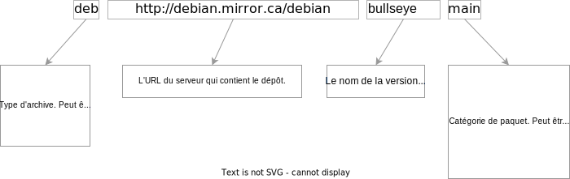
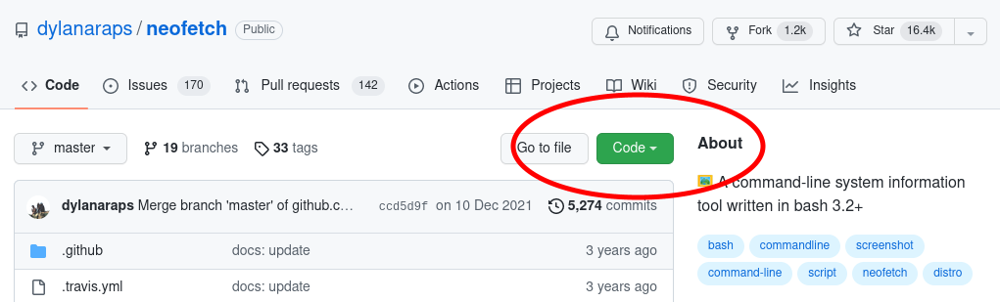

# Installation de programmes

Il y a plusieurs façons d'installer des programmes dans un environnement linux. La plus habituelle consiste à utiliser un *gestionnaire de paquets*.

La plupart des logiciels et programmes disponibles dans une distribution linux sont ajoutés aux *dépôts logiciels* officiels de cette distribution. Ces dépôts sont simplement des serveurs à partir desquels on télécharge les logiciels lorsqu'on veut les installer; il peuvent contenir des milliers d'applications. Les programmes contenus dans un dépôt ont été testés par les développeurs, ce qui garantit un certain niveau de fiabilité.

En plus de cette méthode, il est possible d'installer à partir de paquets qui ne proviennent pas de dépôts, ou encore de compiler des programme et de les installer à partir du code source. Dans ce chapitre nous verrons les 3 méthodes.

## Installation à partir de dépôts
Le *gestionnaire de paquets* est une application qui permet de chercher les logiciels disponibles sur les dépôts, les installer, les mettre à jour et les désinstaller. Dans la distribution *Debian* ce programme est `apt`.

### `apt`
Utilitaire qui permet d'effectuer différentes opérations reliées à l'installation de programmes sur les distributions à bas *Debian*. Les opérations correspondent à la commande qu'on donne à `apt`; les plus communes sont décrites dans le tableau suivant :

| Commande | Utilité | Exemple |
| :-------- | :------- | :------- |
| **install** | Installe le paquet spécifié | <nobr>`apt install emacs`</nobr> |
| **remove** | Désinstalle le paquet spécifié | <nobr>`apt remove emacs`</nobr> |
| **search** | Recherche les paquets dont le nom ou la description contient le terme spécifié  | <nobr>`apt search hex`</nobr> |
| **show** | Affiche les informations sur un paquet | <nobr>`apt show cowsay`</nobr> |
| **update** | Met à jour la base de données locale des paquets disponibles sur les dépôts.<p> Il est utile de lancer ce programme régulièrement. | <nobr>`apt update`</nobr> |

L'avantage d'utiliser `apt` pour installer des programmes est qu'il tient compte des dépendances: par exemple, si le logiciel **bmon** dépend de la librairie **libconfuse2** pour fonctionner correctement, `apt` se charge d'installer **libconfuse2** avant d'installer **bmon**.

Il est possible d'installer plusieurs paquets en même temps en énumérant chacun d'eux à la suite de la commande, comme suit:

```
info@debian:~$ sudo apt install app1 app2 app3
```

Pour plus de détails, faites `man apt`.

### `/etc/apt/sources.list`
Les serveurs qui contiennent les dépôts logiciels sont synchronisés: ils ont tous le même contenu et sont régulièrement mis à jour afin qu'ils soient tous des copies identiques les uns des autres. Afin d'avoir une bonne performance lors du téléchargement et de l'installation, il est recommandé de choisir un dépôt assez proche géographiquement d'où on se trouve.

Au moment de l'installation de *Debian*, il nous est demandé de choisir le dépôt qu'on souhaite utiliser. Si cependant on désire le changer, il faut modifier le fichier `/etc/apt/sources.list`.

Dans ce fichier chaque ligne définit l'url vers un des dépôts utilisés par `apt`. Le format est le suivant:



Il est possible de spécifier plusieurs catégories sur la même ligne, par exemple `deb http://deb.debian.org/debian bullseye main contrib non-free`.

Lorsqu'on fait des modifications à ce fichier, il faut mettre à jour les informations locales sur les logiciels avec la commande `apt update`.

## Installation de paquets avec `dpkg`
Certains développeurs logiciels préfèrent ne pas inclure leurs applications aux dépôts officiels et distribuer directement les paquets. Dans les distributions *Debian* et les dérivées, ces paquets sont des fichiers ayant l'extension `.deb`. Pour les installer, il ne faut pas utiliser `apt`, mais plutôt le programme `dpkg`. Comme `apt`, `dpkg` télécharge et installe les dépendances du programme si elles sont absentes du système. Ce programme dispose de quelques options:

| Option | Utilité | Exemple |
| ------ | ------- | ------- |
| **-i** | Installe la paquet spécifié. | <nobr>`dpkg -i app1.deb`</nobr>|
| **-r** | Supprime le paquet spécifié mais conserve ses dépendances. | <nobr>`dpkg -r app1.deb`</nobr> |
| **-P** | Supprime les dépendances du paquet spécifié, y compris le paquet lui-même s'il n'est pas supprimé. | <nobr>`dpkg -P app1.deb`</nobr> |
| **-l** | Affiche la liste des paquets installés | <nobr>`dpkg -l`</nobr> |

## Installation à partir des sources
Il est possible d'installer des programmes à partir du code source. Puisque les programmes peuvent être codés dans une foule de langages (python, c, java, perl, rust, lua, bash...), la démarche n'est pas exactement la même dans tous les cas. Ici nous verrons la procédure générale pour télécharger, compiler et installer un programme en langage C sur linux.

Installer un programme en C se fait en 4 étapes:
+ Télécharger le fichier qui contient le code source puis le décompresser avec la commande `tar`;
+ Configurer les paramètres de compilation avec la commande `configure`;
+ Compiler le code source pour obtenir l'exécutable avec la commande `make`;
+ Installer sur le système les librairies et exécutables compilés avec la commande `make install`.

Dans ce qui suit nous allons voir en quoi consiste chacune de ces étapes en installant la programme *nmap*. 

> ATTENTION: Le paquet **build-essential** doit avoir été installé au préalable.

### 1. Obtenir le code source via une archive *tar*
En général, le code source du programme est distribué sous la forme d'une archive de format *.tar* compressée. Téléchargez [celle du programme *nmap*](https://nmap.org/dist/nmap-7.93.tar.bz2) puis copiez le fichier dans votre répertoire personnel.

Ensuite lancez la commande suivante pour extraire les fichiers de l'archive:

```
info@debian:~$ tar xzf nmap-7.93.tgz
```
Cette commande créer le répertoire `nmap-7.93/` qui contient les sources du programme. Allez dans ce répertoire.

### 2. Configurer la compilation du programme
Dans le répertoire vous verrez plusieurs fichiers source (.cc et .h) et d'autres programmes. Un de ceux-ci est un programme exécutable nommé `configure`. Lancez-le avec la commande suivante:

```
info@debian:~/nmap-7.93$ ./configure
```
Vous verrez de nombreux messages défiler à l'écran. Lorsque c'est terminé, vérifiez si les dernières lignes contiennent un message du type "Configuration complete": si c'est la cas, passez à l'étape suivante; sinon, identifiez les erreurs et corrigez-les avant de recommencer la configuration.

### 3. Compiler le programme
Le résultat de l'étape précédente est le *Makefile*, un fichier qui contient toutes les options et instructions à donner au compilateur afin que celui-ci crée les exécutables à partir du code. Pour lancer la compilation, on lance l'utilitaire `make` (qui appelle à son tour le compilateur `gcc` avec les options définies dans le *Makefile*). La commande est la suivante:
```
info@debian:~/nmap-7.93$ make
```
Encore une fois vous verrez défiler des informations qui correspondent cette fois-ci aux commandes de compilation. Tout dépendant de la taille et de la complexité du programme, la compilation peut être rapide ou durer longtemps.

Si vous ne voyez aucun message d'erreur particulier, alors passez à la prochaine étape.

### 4. Installer le programme
La dernière étape consiste à copier les programmes compilés vers les répertoires où ils pourront être utilisés dans l'ensemble du système linux: en effet, pour l'instant ils se trouvent toujours dans votre répertoire personnel. La commande est la suivante:

```
info@debian:~/nmap-7.93$ sudo make install
```
Le programme est ensuite installé: testez-le en le faisant afficher sa version, comme suit:

```
info@debian:~$ nmap -V
```


### Quelques mots sur *git*
De nombreux programmes peuvent être téléchargés grâce à *git*, un utilitaire qui permet de gérer les projets de développement logiciels de petite, moyenne et grande envergure. 

Il ne s'agit pas ici de décrire toutes les fonctionnalités de *git*, qui sont nombreuses et relativement complexes; il faut seulement dire qu'il est assez fréquent que des programmes soient disponibles sur GitHub, GitLab, Bitbucket, etc. et qu'il est donc possible d'en obtenir les sources sur ces plateformes plutôt que via une archive *tar*. Lorsque c'est le cas, on n'aura qu'à télécharger localement les répertoires du code source à partir de la page du projet. 

Par exemple, pour télécharger les sources du programme *neofetch*, allez dans la page GitHub du projet puis cliquez sur le bouton `Code`. Ceci vous permettra d'accéder au lien de téléchargement.



Copiez ce lien puis utilisez la commande `git clone` pour copier les sources localement, comme suit:

```
info@debian:~$ git clone https://github.com/dylanaraps/neofetch.git
```
> REMARQUE: Ici, vous pouvez immédiatement lancer `make install` car *neofetch* n'est pas un programme en C, c'est un simple script qui peut être directement interprété par bash.


