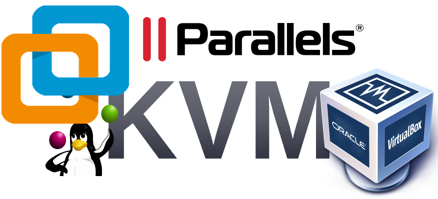
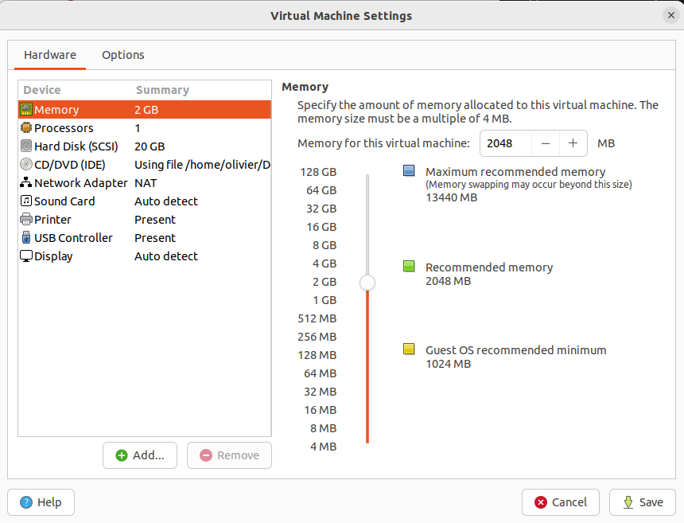
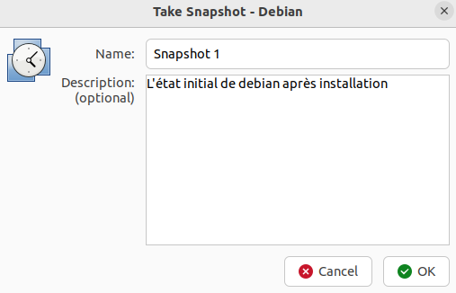
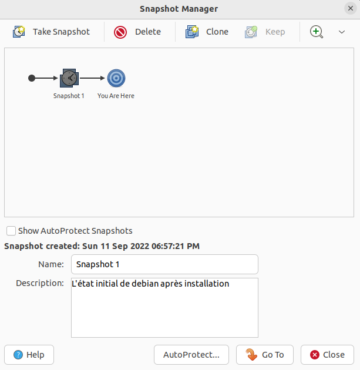

# Virtualisation

## Qu'est-ce que la virtualisation?
En termes simples, la virtualisation permet d'exécuter un système d'exploitation (appelé *invité*) à l'intérieur d'un autre système d'exploitation (qu'on nomme *hôte*), comme on le ferait avec un programme "ordinaire". 

Les systèmes d'exploitation (SE) sont, après tout, des logiciels à la base. Cependant ils se distinguent des logiciels ordinaires car ils servent (entre autres) à organiser l'utilisation des ressources matérielles d'un PC: par exemple, lorsque 3 applications ont besoin de lire des données sur le disque, c'est le SE qui leur donne accès à tour de rôle. Pour ce faire, les SE ont besoin d'avoir un accès direct aux ressources matérielles d'un PC. Mais lorsqu'on utilise un SE dans un contexte de virtualisation, c'est l'*hôte* qui a accès au matériel, pas l'*invité*. 

Les logiciels de virtualisation, comme *VMWare Workstation* mais aussi *VirtualBox*, *Parallels* (sur Mac) ou *KVM* (sur linux), servent à donner un accès "virtuel" aux ressources matérielles d'un système informatique: ainsi, les SE invités auront l'impression de parler directement aux composantes matérielles, mais en réalité elles parlent à des composantes matérielles virtualisées par le logiciel. Par exemple, le disque dur d'une machine virtuelle *Windows* invitée sera en réalité un fichier de 20 Go sur le système d'exploitation hôte.

Les usages de la virtualisation sont très nombreux, par exemple:
+ Partager les ressources matérielles d'un système afin des les utiliser à leur maximum (et diminuer les côuts)
+ Tester des logiciels en les isolant du SE hôte
+ Vérifier le fonctionnement d'un programme sur différentes plateformes
+ Faciliter la maintenance des systèmes informatiques

## Gestion des machines virtuelles (VM)

Dans ce qui suit on se penche sur les différentes fonctionnalités de VMWare Workstation.

Tout d'abord, pour démarrer une VM, il s'agit d'aller dans le menu `VM -> Power -> Start Up Guest`.

Il y a plusieurs moyens d'arrêter une VM. 
+ **Mettre en pause**: Stoppe l'exécution de tous les processus sur la VM, sans arrêter la VM. Il est impossible de fermer *Workstation* si des VM sont dans cet état.
+ **Suspendre**: Met la VM en pause et sauvegarde son état matériel dans un fichier. Ceci permet de fermer *Workstation* pui de retrouver la VM dans le même état plus tard, lors d'une autre séance de travail.
+ **Éteindre** ("Shut down"): Lance le processus d'extinction à partir du système d'exploitation de la VM. C'est la manière "propre" d'éteindre une VM.
+ **Couper l'alimentation** ("Power off"): Arrête le SE de la VM sans passer par le processus normal d'extinction. Correspond à débrancher le câble d'un PC; ceci peut entraîner des pertes de données. 

## Propriétés d'une VM
Lors de la création de la VM, il est possible de définir plusieurs options, comme on l'a vu plus haut. Ces paramètres restent accessibles après la création de la VM. Pour ce faire on doit aller dans le menu `VM -> Settings` (aussi accessible avec un `clic-droit` sur le nom de la VM dans le panneau de gauche). Ces paramètres peuvent être modifiés, mais pour ce faire il faut éteindre la VM.

Ce qu'on modifie ici sont les composantes matérielles virtualisées de la VM. Pour certaines composantes (par exemple les disques, les interfaces réseau, etc.) il est possible d'en ajouter ou d'en supprimer (boutons `Add` et `Remove`).

### **Mémoire**
Il est possible de spécifier très précisément la quantité de mémoire allouée à la VM. Attention cependant: si vous n'en allouez pas assez, la VM risque de mal fonctionner, et si vous en allouez trop c'est votre PC qui pourrait être affecté... La limite inférieure est généralement donnée dans les spécifications techniques du SE : par exemple, Debian recommande 2Go; Windows 11, 4Go; etc. Pour la limite supérieure, il est préférable de ne pas dépasser la quantité de RAM réelle de l'hôte.

### **Processeur**
On peut changer la configuration du processeur virtuel, plus précisément: le nombre de CPU virtuels et le nombre de coeurs par CPU.

### **Disques**
Dans cette section on peut effectuer des opérations sur les disques virtuels. Ceux-ci correspondent en réalité à un fichier sur l'hôte ayant le même nom que la VM. Quatre tâches sont possibles:
+ **Monter**: Connecter le disque sur le système hôte. Ceci est une manière d'accéder aux fichiers de la VM à partir de votre PC (mais il y en a d'autres plus simples).
+ **Défragmenter**: La défragmentation est une opération qui permet d'améliorer les performances d'un disque. Attention, seuls les disques utilisés par les systèmes Windows bénéficient de la défragmentation.
+ **Étendre**: Permet d'augmenter l'espace du disque virtuel. Ceci change uniquement la taille du fichier sur l'hôte: la VM n'utilisera pas automatiquement l'espace nouvellement disponible. Pour que ce soit le cas il faudra utiliser un éditeur de partition à l'intérieur de la VM.
### **CD/DVD**
Ici on peut associer un fichier ISO au lecteur virtuel de la VM.

### **Adaptateur réseau**
Permet de choisir le type de connexion au réseau de la VM (plus de détails dans la section *Connexion au réseau*).

### **Carte son, Imprimante, Contrôleur USB**
Donne à la VM l'accès à ces périphériques sur l'hôte physique.

### **Affichage**
Permet de définir la résolution de l'écran sur la VM et d'activer l'accélération graphique.

## Connexion au réseau
Il y a 3 manières de connecter un réseau à une VM. Chacun a ses avantages et ses inconvénients et découle de ce qu'on veut faire avec la VM.
+ **Host-only**: Un réseau virtuel, isolé du réseau sur lequel l'hôte est connecté, est créé par *VMWare*. La VM se connectera sur ce réseau virtuel: elle n'a donc pas accès à l'extérieur, mais s'il existe d'autre VM sur ce même réseau "Host-only", elles pourront communiquer ensemble.
+ **NAT**: Un réseau virtuel est créé mais cette fois-ci *VMWare* joue le rôle de passerelle sur ce réseau, ce qui permet aux VM d'accéder à l'extérieur (réseau local de l'hôte et plus).
+ **Bridged**: L'interface réseau de l'hôte est partagée avec la VM, ce qui fait que celle-ci est connectée sur le même réseau que l'hôte. La VM apparaît donc comme un PC parmi d'autres sur le réseau local.  

## Instantanés ("Snapshots")
Les *instantanés* permettent de sauvegarder l'état d'une VM à un moment spécifique afin de pouvoir y revenir ultérieurement. Ceci est utile lorsque des modifications qu'on apporte à la VM (par exemple, l'installation de logiciels ou de mises à jour) entraînent des problèmes: alors on n'a qu'à revenir à un instantané qui correspond à l'état de la VM avant l'installation.

Pour créer un instantané, on peut aller dans le menu `VM -> Snapshots -> Take Snapshot`. Il est possible de lui donner un nom et une courte description:

Pour gérer les instantanés, il faut aller dans le menu `VM -> Snapshots -> Snapshot Manager`. Ceci affiche la fenêtre suivante:

Ici on peut voir tous les instantanés qui existent pour cette VM. On peut revenir à un instantané précédent avec le bouton `Go To`, mais  également les cloner ou les supprimer. 

La fonction `AutoProtect`, lorsqu'elle est activée, permet d'automatiser la création d'instantanés: Workstation prendra alors un instantané chaque demi-heure, chaque heure ou chaque jour, selon l'intervalle qu'on a choisie.

## Cloner une VM

Lorsqu'on clone une VM, *Workstation* crée une nouvelle VM en tous points identique. Le clone peut être basé sur l'état actuel de la VM ou encore sur un instantané de la VM.

Il existe deux types de clone: les clones **liés** et les clones **complets**.
+ Les clones *complets* sont une copie conforme de la VM: au moment de la copie, les fichiers de la nouvelle VM auront la même taille que ceux de l'ancienne VM.
+ Les clones *liés* demandent moins de ressources de stockage: dans les fichiers qui composent le clone lié, on ne conserve que la différence entre la VM originale et le clone. En contrepartie, les performances sont moins élevées qu'avec un clone complet ([réf.](https://www.vmware.com/content/dam/digitalmarketing/vmware/en/pdf/techpaper/performance/cloning-vSphere7-perf.pdf))

## Exporter une VM

Il est possible de distribuer une VM afin de la déployer dans un autre hyperviseur: le format OVF (*Open Virtualization Format*) est une norme de représentation des VM supportée par la plupart des hyperviseurs et qui permet en théorie différents hyperviseurs de s'échanger des VM (dans la réalité, ce n'est pas si simple...).

Pour exporter une VM, on doit aller dans `File -> Export to OVF` et choisir le répertoire de destination.

L'exportation crée plusieurs fichiers dont les extensions seront les suivantes:
+ **.mf**: Le *manifeste*, qui contient les hachages des autres fichiers. Ces hachages permettent de vérifier s'ils sont en bon état. 
+ **.ovf**: Un fichier au format XML qui contient tous les paramètres de la VM.
+ **.vmdk**: Le ou les fichiers qui contiennent les données du disque de la VM. Ce fichier est généralement assez volumineux.
+ **.iso**: Si le lecteur CD/DVD de la VM contenait un fichier *.iso*, alors celui-ci sera inclus dans l'exportation.
  
Pour importer une VM dans *Workstation*, il s'agit de double-cliquer sur le fichier `.ovf` pour l'ouvrir.

## Accès au BIOS

*VMWare Workstation* donne accès à un BIOS virtuel qui permet de régler les paramètres habituels d'un BIOS (ordre d'amorçage, mot de passe de démarrage, date et heure, etc.)

Pour y accéder, allez au menu `File -> Power -> Power On to Firmware`

