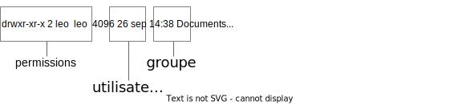
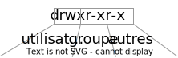

# Utilisateurs et permissions

*Pour pouvoir faire les commandes décrites dans cette section, vous devez avoir les permissions de l'utilisateur root. À cette fin, Sur la VM 'BaseDebian.ova', lancez la commande suivante à partir d'un terminal:*
```
info@debian:~$ sudo su -
```

## Comptes d'utilisateurs
En linux comme dans la plupart des systèmes d'exploitation il peut y avoir plusieurs utilisateurs sur un même système. Les utilisateurs peuvent ouvrir des sessions sur linux, lancer des programmes et manipuler des fichiers. Ils peuvent avoir des permissions différentes sur les fichiers et les programmes, ce qui explique qu'on protège les comptes utilisateurs par des mots de passe.

Dans Debian, le premier compte utilisateur est créé au moment de l'installation; il est par la suite possible d'en créer d'autres.

Il existe deux commandes pour créer des utilisateurs: 

### `adduser` 
Permet de créer des utilisateurs en mode "interactif" (des questions vous sont posées pour entrer chacune des informations sur l'utilisateur). C'est la commande la plus simple à utiliser dans le terminal lorsqu'on veut créer un utilisateur à la fois.

*Exemple*
```
root@debian:~$ adduser maria
```

### `useradd`
Permet de créer des utilisateurs en une seule commande; les informations autres que le nom de l'utilisateur doivent être spécifiées par des options de la commande.

| Option | Utilité | Exemple |
| ------ | ------- | ------- |
| `-m` | Crée le répertoire personnel au même nom que l'utilisateur | <nobr>`useradd -m bob`</nobr> |
| `-d` | Utilisé avec l'option `-m`, permet de spécifier un répertoire personnel différent | <nobr>`useradd -md /home/tmp bob`</nobr> |
| `-s` | Permet de spécifier un "shell" | <nobr>`useradd -s /bin/bash bob`</nobr> |
| `-G` | Associe des groupes supplémentaires à l'utilisateur | <nobr>`useradd -G groupe1,groupe2 bob`</nobr> |

*Exemples*
```
root@debian:~$ useradd maria
root@debian:~$ useradd -m -s /bin/bash -G webmin maria
```

> **REMARQUE**: La commande `useradd` n'a pas d'option qui permet de définir simplement le mot de passe d'un utilisateur. On doit donc utiliser une autre commande, `passwd`, pour donner un mot de passe à l'utilisateur nouvellement créé. Une autre possibilité est d'utiliser la "recette" suivante:
```
root@debian:~$ useradd -m bob && echo "bob:abc-123" | chpasswd
```

### `deluser` et `userdel`
Supprime un utilisateur et les entrées qui lui correspondent dans les fichiers `/etc/passwd`, `/etc/shadow` et `/etc/group`. Ne supprime pas le répertoire personnel : pour ce faire il faut utiliser `deluser --remove-home` ou `userdel -r`.

*Exemples*
```
root@debian:~$ deluser --remove-home maria
root@debian:~$ userdel -r maria
```

Les fichiers qui contiennent les informations sur les utilisateurs sont les suivants:

### `/etc/passwd`
Contient les noms et les paramètres généraux de fonctionnement de chaque compte utilisateur.

Chaque ligne de ce fichier correspond à un utilisateur; les informations sont séparées par des `:` et sont structurées comme suit:


### `/etc/shadow`
Contient les informations relatives aux mots de passe des utilisateurs. Le mot de passe n'est pas stocké "en clair": c'est plutôt leur *valeur de hachage* (une représentation cryptographique) qui est écrite dans le fichier.

### `/etc/login.defs`
Contient des informations (sous formes de variables) utilisées lors de la création des utilisateurs.

<!--
Quiz semaine 6 next
Attention: travaux à remettre en classe = pas notés
Faire adduser, regarder /etc/passwd, /etc/shadow, /etc/home, login/logout
Faire useradd: entrée dans /etc/passwd et les liens sont là mais pas de /home/, shell différent, ni de login possible (mdp absent)
+ Manque le mdp, le répertoire perso, le shell

`useradd -m bob` crée le répertoire perso

Mot de passe? Utiliser passwd ensuite. Sinon recette: useradd -m bob && echo "bob:abc-123" | chpasswd

Manque toujours le shell

=> useradd -m -s /bin/bash
-->

## Groupes
Les utilisateurs peuvent faire partie de *groupes*. 

Les groupes sont une manière de donner à plusieurs utilisateurs des permissions semblables sur des fichiers ou des programmes. Par exemple, si on veut permettre à 5 utilisateurs de lire un fichier, on crée un groupe, on donne les permissions de lecture sur le fichier à ce groupe, puis ensuite on ajoute les 5 utilisateurs au groupe. Cette manière de procéder est parfois plus simple que de donner des permissions à chaque utilisateur séparément.

Les informations sur les groupes d'utilisateurs sont stockées dans le fichier `/etc/group`.

Les commandes pour modifier les groupes sont les suivantes:

### `addgroup` 
### `groupadd`
### `delgroup`
### `groupdel`
Permettent de créer ou supprimer des groupes. Il existe des options mais la plupart correspondent à des utilisations très spécifiques et sont généralement inutiles, à l'exception d'une: lors de la suppression d'un groupe, `--only-if-empty` (utilisé avec `deluser`) ne supprimera pas un groupe s'il existe des utilisateurs qui en font partie.

*Exemples:*
```
root@debian:~$ addgroup groupe1
root@debian:~$ groupadd groupe2
root@debian:~$ delgroup groupe2
root@debian:~$ groupdel groupe1
```

## Modification d'utilisateurs ou de groupes
Après sa création, il est possible de modifier les propriétés d'un utilisateur ou un groupe. Les commandes correspondantes sont les suivantes:

### `groupmod`
Permet de changer les informations d'un groupe. Généralement on change son nom ou son identifiant.

| Option | Utilité | Exemple |
| ------ | ------- | ------- |
| `-g` | Changer l'ID du groupe. L'option est suivie du nouvel ID. | `groupmod -g 999 groupe1`</nobr> |
| `-n` | Changer le nom du groupe. L'option est suivie du nouveau nom. | `groupmod -n gr1 groupe1`</nobr> |


### `usermod`
Permet d'effectuer la gestion d'un compte utilisateur. 

| Option | Utilité | Exemple |
| ------ | ------- | ------- |
| `-u` | Changer l'ID de l'utilisateur. L'option est suivie du nouvel ID. | <nobr>`usermod -u 1100 alice`</nobr> |
| `-l` | Changer le nom de l'utilisateur. L'option est suivie du nouveau nom. | <nobr>`usermod -l mvasquez maria`</nobr> |
| `-aG` | Ajouter l'utilisateur à un ou plusieurs groupes. | <nobr>`usermod -aG groupe1 alice`</nobr> |
| `-md` | Créer un nouveau répertoire personnel et y déplacer le contenu de l'ancien | <nobr>`usermod -md /home/temp kratos`</nobr> |
| `-s` | Créer le *shell* de l'utilisateur. | <nobr>`usermod -s /bin/bash sami`</nobr> |
| `-L` | Verrouiller le compte. | <nobr>`usermod -L bob`</nobr> |
| `-U` | Déverrouiller le compte. | <nobr>`usermod -U bob`</nobr> |

## Autres commandes utiles
### `whoami`
Affiche le nom de l'utilisateur courant.

### `id`
Affiche les identifiants d'un utilisateur et ceux des groupes dont il fait partie. Sans argument, affiche les informations de l'utilisateur courant.

*Exemples:*
```
root@debian:~$ whoami
root@debian:~$ id
root@debian:~$ id bob
```
  

## Permissions

En linux, tout est un fichier, que ce soit un fichier ordinaire, un programme, un répertoire ou un périphérique. Chacun de ces fichiers est associé à des *permissions* qui spécifient comment les utilisateurs peuvent s'en servir.

Chaque fichier est associé à un utilisateur et à un groupe. 

Les permissions touchent à la **lecture**, l'**écriture** ou l'**exécution** des fichiers. 

Pour chaque fichier, on peut donc définir des permissions de lecture, d'écriture et d'exécution différentes pour l'utilisateur, le groupe et les autres.

> **REMARQUE**: Exécuter un fichier consiste à lancer le programme qui correspond au fichier; exécuter un répertoire consiste à s'y déplacer.

Par exemple, pour un fichier nommé `doc1`, son propriétaire est **carl** et son groupe est **admin**. On peut définir les permissions suivantes:
+ **carl** a les droits de lecture et d'écriture sur le fichier
+ Les membres du groupe **admin** ont seulement les droits de lecture
+ Les autres utilisateurs ne peuvent ni lire ni écrire dans le fichier 

L'option `-l` de la commande `ls` permet d'afficher les informations relatives aux permissions des fichiers:



Dans la partie *permissions*, le premier caractère donne le type de fichier (`d` pour les répertoires et `-` pour les fichiers ordinaires). Les 9 caractères qui suivent donnent les permissions de lecture (r), écriture (w) ou exécution (x) pour l'utilisateur, le groupe et les autres respectivement:



Dans l'exemple précédent, les permissions sont les suivantes:
+ Le fichier est un répertoire
+ L'utilisateur propriétaire a les droits de lecture, écriture et exécution
+ Les membres du groupe ont les droits de lecture et d'exécution
+ Les autres ont les droits de lecture et d'exécution

Deux commandes sont utiles pour modifier les permissions d'un fichier: `chown` et `chmod`. 

### `chown`
Cette commande permet de changer le propriétaire ("Change Owner") ou le groupe d'un fichier. Elle doit être suivie d'une expression de forme **UTILISATEUR:GROUPE**, qui définit les nouveaux propriétaires, puis du nom du fichier. On peut omettre un des deux termes si on veut seulement changer le groupe ou l'utilisateur. Par exemple:
+ `chown bob:groupe1 document1` : le fichier *document1* aura 'bob' et 'groupe1' comme propriétaires
+ `chown bob document2` : le fichier *document1* aura 'bob' comme propriétaire (le groupe ne change pas)
+ `chown :groupe1 document3` : le fichier *document3* aura 'groupe1' comme propriétaire (l'utilisateur propriétaire ne change pas)


### `chmod`
Cette commande permet de changer les permissions d'un fichier ("Change Mode"). Elle fonctionne de deux manières: en notation **symbolique** ou en notation **octale**.

Dans la notation **symbolique**, on définit 3 termes: 
+ Pour qui on modifie les permissions:
  + `u`: utilisateur
  + `g`: groupe
  + `o`: les autres
  + `a`: tous 
+ Le type de modification:
  + `+`: ajouter une permission
  + `-`: enlever une permission
  + `=`: affecter la valeur donnée
+ Les permissions
  + `r`: lecture
  + `w`: écriture
  + `x`: exécution

La commande doit être suivie d'une expression composée de ces termes puis du nom du fichier. Quelques exemples:
+ `chmod g+x doc2`: On ajoute au fichier *doc2* les droits d'exécution pour le groupe propriétaire
+ `chmod a=rw doc2`: Les permissions sur *doc2* seront `rw` pour tous
+ `chmod go-w doc2`: On ôte les permissions d'écriture sur le fichier *doc2* pour le groupe et les autres utilisateurs
+ etc.

Dans la notation **octale**, on associe une valeur numérique à chaque type de permission:
+ `r` vaut 4
+ `w` vaut 2
+ `x` vaut 1

Ensuite on additionne ces valeurs pour obtenir un nombre:
+ 5 correspond à `r-x` (4+1)
+ 6 correspond à `rw-` (4+2)
+ 7 correspond à `rwx` (4+2+1)
+ 4 correspond à `r--` (4)

La commande `chmod` doit ensuite être suivie de 3 nombres (le premier pour l'*utilisateur*, le deuxième pour le *groupe* et le troisième pour les *autres*) puis du nom du fichier. Quelques exemples:
+ `chmod 666 doc2`: Les permissions sur *doc2* seront `rw-rw-rw-` (`rw` pour tous)
+ `chmod 700 doc2`: Les permissions sur *doc2* seront `rwx------` (le propriétaire a les droits de lecture, écriture et exécution)
+ `chmod 644 doc2`: Les permissions sur *doc2* seront `rw-r--r--`


   
## Élévation de privilèges
Dans linux il y a un utilisateur qui a toutes les permissions : ***root***. Lorsqu'on a ouvert une session en tant que *root*, il est possible de lire, écrire et créer n'importe quel fichier, et il est aussi possible de modifier les permissions de n'importe uel fichier.

Étant donné le risque de sécurité que cela constitue, plusieurs distributions linux empêchent carrément de se connecter comme *root*. Le compte *root* existe, mais on doit l'utiliser par le biais d'une commande particulière : `su`.


### `su`
Cette commande ("Substitute User") ouvre une session au nom d'un autre utilisateur, avec tous les privilèges de celui-ci. On l'utilise généralement pour ouvrir une session comme *root* à partir d'une autre session.

Pour ouvrir une session comme un autre utilisateur "normal", on donne son nom à la suite de la commande et ensuite on donne son mot de passe, comme suit:
```bash
info@debian:~$ su alice
Mot de passe : 
alice@debian:/home/info$ _
```
Si on ne met pas le nom d'un utilisateur après `su`, c'est sur le compte de *root* qu'on se connecte:
```bash
info@debian:~$ su 
Mot de passe : 
root@debian:/home/info$ _
```
Remarquez qu'on ne change pas de répertoire suite à cette commande: à la première ligne, l'invite de commande montre qu'on se trouve dans le répertoire `~`, le répertoire personnel de *info*, mais après avoir changé d'utilisateur on utilise le chemin absolu `/home/info` car pour le nouvel utilisateur ce n'est plus le répertoire personnel (`~` ne correspond plus à `/home/info`).

Si on souhaite se retrouver dans l'environnement de l'utilisateur (répertoire personnel et variables), on ajoute l'option `-`:
```bash
info@debian:~$ su - sam
Mot de passe : 
sam@debian:~$ _
```
> **ATTENTION**: Dans plusieurs distributions linux, l'utilisateur *root* est créé sans mot de passe. Il est donc impossible de se connecter sur son compte en utilisant `su`

### `sudo`
Cette commande ("Substitute User Do") permet de lancer une autre commande avec les privilèges de *root*. Il s'agit d'invoquer `sudo` suivi de la commande complète qu'on veut exécuter, suivie de son propre mot de passe:
```bash
info@debian:~$ cat /etc/shadow
cat: /etc/shadow: Permission non accordée
info@debian:~$ sudo cat /etc/shadow
[sudo] Mot de passe de info :
...
``` 
 Attention, pour pouvoir utiliser `sudo`, un utilisateur doit être membre du groupe *sudo* ou encore être spécifié dans le fichier `/etc/sudoers`.

Il est préférable, du point de vue de la sécurité, d'utiliser `sudo` plustôt que `su`. Les raisons sont les suivantes:
+ `sudo` utilise le mot de passe de l'utilisateur qui appelle `sudo`, donc le mot de passe de `root` n'a pas besoin d'être partagé
+ C'est *root* qui décide qui peut exécuter la commande `sudo`, donc il y a un meilleur contrôle
+ Le risque d'erreur est moins grand car on ne peut lancer qu'une commande à la fois
+ Le fait d'utiliser `sudo` a pour effet que les utilisateurs sont conscients d'utiliser une commande privilégiée et possiblement "dangereuse" 


  


  
